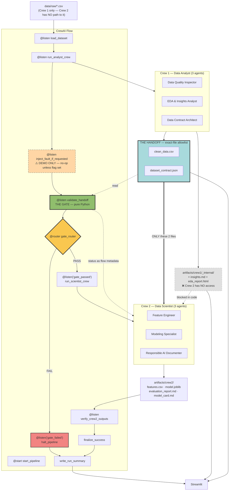

# Harbor & Vale — Industry-Simulated AI Product Workflow
## תוכנית פרויקט טכנית — גרסה 2 (מתוקנת) · PLAN ONLY

> **גרסה 2** מגלמת 15 תיקוני ארכיטקטורה. שלושה מהם תיקנו באגים אמיתיים בגרסה 1:
> הדגמת הכשל הייתה לוגית שבורה (Crew 1 היה מייצר מחדש את הקובץ המחובל לפני שהשער רואה אותו);
> לא הוגדר מנגנון CrewAI אמיתי ל-interleaving בין סוכן לקוד;
> וסטטיסטיקות נצפות הומרו אוטומטית לאילוצים עסקיים קשיחים.

---

## Context — למה אנחנו בונים את זה

הבריף הרשמי אותר ונקרא במלואו ב-`/Users/ofekperez/Desktop/Final Project/final_projec.html`. שתי אמירות מכריעות ממנו:

> *"The hard part, and the part Harbor & Vale is actually asking for, is the **seam**: a contract that one crew writes and the other must honour, and a Flow that checks it before anything downstream is allowed to run."*

> *"The contract is a file, not a conversation. `dataset_contract.json` is the only thing Crew 2 is allowed to assume."*

התקרית המקורית: אנליסטים שינו `order_value` מסנטים לדולרים, שינו שמות שדות, הסירו עמודה. מודל ה-churn נטען, אימן והריץ תחזיות — **בלי שגיאה אחת**. חמישה שבועות של תקציב שימור בוזבז על הלקוחות ההפוכים.

הכשל לא היה טכני. הוא היה **סמנטי**.

---

## סטטוס הסביבה (נבדק בפועל)

| פריט | ממצא |
|---|---|
| תיקיית עבודה | `/Users/ofekperez/Desktop/CrewAI_Final_Project:` — **ריקה**, ללא git. נקודתיים בסוף השם |
| Git · gh | 2.50.1 ✅ · gh 2.92.0 ✅ |
| Python | 3.13.9 מ-**anaconda base** — ⚠️ לא נשתמש בו כסביבת הפרויקט |
| CrewAI | **לא מותקן**. אחרונה 1.15.20, `requires_python: >=3.10,<3.14` |
| מותקנים ב-base | pandas, sklearn, matplotlib, seaborn, streamlit, Flask, joblib, jsonschema, pydantic, pytest — ⚠️ **ב-base, לא זמין לנו** |
| מפתחות LLM | **אין** |
| עבודה קודמת | אין |

**API של Flow אומת מול הדוקומנטציה הרשמית:** `from crewai.flow.flow import Flow, listen, start, router, or_, and_` · `Flow[StateModel]` עם Pydantic · `kickoff()` · `plot()`.
⚠️ **API ברמת ה-Task** (`output_pydantic`, `guardrail`, `callback`) **טרם אומת** — זה בדיוק מה שה-spike בשלב 1 קיים בשבילו.

### החלטות שנסגרו
שינוי שם התיקייה · OpenAI · Churn (סיווג בינארי) · עבודה לבד.

---

# A. Executive Understanding

### מה הפרויקט מודד

**סדר העדיפויות הפנימי שלנו** — לא רובריקת ציונים רשמית; הבריף לא מפרסם משקלות:

1. **עיצוב ממשק בין מערכות אוטונומיות.** חוזה מכונה-אכיף בין שני צדדים שלא סומכים זה על זה, ואכיפתו לפני שנזק מתרחש.
2. **הפרדה נכונה בין שיפוט לחישוב.** מתי LLM הוא הכלי הנכון ומתי הוא המסוכן. מי שנותן ל-LLM להחליט PASS/FAIL — לא הבין את הפרויקט.
3. **תרגול מעשי של בניית סוכנים.** זו הסיבה האישית שבחרת בפרויקט (ראו פרק X).
4. **משמעת הנדסית.** שחזוריות, לוגים, בדיקות, היסטוריית Git שמספרת סיפור.

### איך נראית הצלחה

הרצה מלאה מייצרת 8 ארטיפקטים ועוברת את השער. ואז — **בלי לגעת בקוד** — הרצה עם `--inject-failure scale_change` מזריקה תקלה בדיוק אחרי ש-Crew 1 סיים, השער נכשל עם הודעה קריאה, ו-**Crew 2 בכלל לא מתחיל**.

### איך הארכיטקטורה מונעת את התקרית — ניתוח כן

לאחר תיקון #3 (הפרדת סטטיסטיקות מאילוצים), התמונה **יותר צנועה ויותר נכונה** מגרסה 1:

| שכבה | מה תופסת | מה קורה בתרחיש "×100" |
|---|---|---|
| **1. סכימה** — שמות, dtypes, עמודות חובה | שינוי שם, מחיקה, שינוי טיפוס | **עוברת** ✅ — `float64` נשאר `float64`. **זה בדיוק הכשל המקורי** |
| **2. אילוצים עסקיים מנומקים** — nullable, תחום קטגוריאלי סגור, טווח עסקי **כשיש הצדקה** | ערכים שמפרים כלל עסקי מוצהר | **תלוי.** אם הסוכן הצדיק `min: 0` בלבד — עוברת. אם הצדיק גם תקרה — נכשלת. **לא מסתמכים עליה** |
| **3. גילוי דריפט קנה-מידה + שלמות** — טביעת אצבע התפלגותית מול הצילום שבחוזה, + `sha256` | **שינוי קנה מידה / יחידות, דריפט סמנטי, קובץ שנגעו בו** | **נכשלת חד-משמעית** ❌ — median פי 100, יחס מזוהה כחשוד; sha256 לא תואם |

**הנקודה החשובה:** מה שתופס את התקרית הוא **שכבה 3**, ולא במקרה. סכימה לבדה מפספסת אותה בהגדרה, ואילוצים עסקיים לא תמיד יכולים להיות מוצדקים בלי ידע דומיין. לכן **טביעת האצבע ההתפלגותית היא לב ההגנה** — והיא מוגדרת נכון: היא **גלאי שינוי ביחס לצילום מצב מתועד**, לא כלל עסקי.

> **התשובה לשאלה הקונספטואלית: כן** — עם ניסוח מדויק: *הארכיטקטורה תופסת את השינוי כי היא מתעדת צילום מצב מוסכם של הדאטה ובודקת סטייה ממנו, לא כי היא "יודעת" מה נכון עסקית.*

---

# B. דרישות בלתי-ניתנות-למשא-ומתן

### B.1 דרישות קורס (מהבריף הרשמי)

CrewAI · Python · Git + GitHub + Pull Requests · Streamlit **או** Flask · HTML+CSS (רשות) · Pandas · Scikit-learn · Matplotlib/Seaborn · Crew 1 ≥3 סוכנים · Crew 2 ≥3 סוכנים · 4+4 ארטיפקטים · ≥2 וריאציות מודל · Flow שמאוטמט את ההעברה · ולידציה בגבול · fail gracefully · שחזוריות · לוגים · ארטיפקטים ב-repo · סודות מחוץ ל-repo · הדגמת שבירה מכוונת · **Crew 2 קורא ומאמת את הדאטה והחוזה** (ראו פרק F.0).

### B.2 דרישות ארכיטקטורה

- **A1** — PASS/FAIL דטרמיניסטי בלבד. ל-LLM אין קול.
- **A2** — Crew 2 חסום מכנית מ-raw ומפנימיות Crew 1, ב**allowlist של קבצים מדויקים**.
- **A3** — החוזה מגן מפני שינוי שם, מחיקה, שינוי טיפוס, שינוי קנה מידה, שינוי משמעות קטגורית.
- **A4** — הפרדה מפורשת בין אחריות סוכן לאחריות Python.
- **A5** — תרחיש כשל שמשחזר את רוח התקרית: שינוי משמעות תוך שמירה על טיפוס תקין.
- **A6** — ארכיטקטורת הסוכן המינימלית. אין סוכן לכל דבר.
- **A7** — לא לנעול דאטהסט מוקדם מדי.
- **A8** — אין over-engineering.
- **A9** *(חדש)* — **אין fallback שקט לסוכנים קריטיים.** כשל גלוי > הצלחה מזויפת.
- **A10** *(חדש)* — **אין מטא-דאטה סמנטית מומצאת.** יחידה מוצהרת רק אם מתועדת.
- **A11** *(חדש)* — **הזרקת תקלות לעולם לא במסלול הייצור.**

### B.3 דרישות ה-workflow שלך

`working flow` בשם המדויק · סיכום סשן עם 11 הכותרות · קריאת הסיכומים בתחילת סשן · אפס סודות · 9 נקודות לכל סוכן · תשובות בעברית.

---

# C. ארכיטקטורת המערכת



### עקרון הליבה — "Agent Plans, Python Executes"

```
┌──────────────┐  JSON מובנה  ┌──────────────┐  אם לא חוקי   ┌───────────────┐
│  Agent (LLM) │ ────────────▶│  guardrail   │ ─── retry ───▶│ Python Executor│
│  שיפוט וכוונה │              │  Pydantic    │  ואז כשל גלוי  │  ביצוע דטרמיניסטי│
└──────────────┘              └──────────────┘               └───────────────┘
```

הסוכן לא כותב CSV, לא מחשב ממוצע, ולא מחליט PASS/FAIL. הוא מייצר **תוכנית מובנית**; התוכנית עוברת ולידציה; Python מבצע. פלט ה-LLM עשוי להשתנות בין הרצות — **הביצוע נשאר דטרמיניסטי ובר-ביקורת**, והתוכנית נשמרת כארטיפקט.

---

# C.2 ⭐ מנגנון הביצוע ב-CrewAI — איך ה-interleaving באמת עובד

> **זהו התיקון הטכני החשוב ביותר בגרסה 2.** גרסה 1 ציירה `Agent → Python → Agent` בלי להסביר איך זה מתבצע בפועל בתוך `Process.sequential`.

### C.2.1 המנגנונים שנשקלו

| מנגנון | האם מתאים | נימוק |
|---|---|---|
| **Tool** שהסוכן קורא לו | ❌ לשלב חובה | הסוכן מחליט **אם ומתי** לקרוא. לא מובטח. מתאים רק לקריאת הקשר |
| **Task `callback`** | ✅ **כן** | רץ **תמיד** אחרי שהמשימה הסתיימה, מקבל `TaskOutput`. מובטח ובסדר |
| **Task `guardrail`** | ✅ **כן** | מאמת פלט מובנה, מחזיר `(False, msg)` → CrewAI מריץ retry עם משוב |
| **`output_pydantic`** | ✅ **כן** | מכריח סכימה על פלט המשימה |
| **`context=[prev_task]`** | ✅ **כן** | העברת הקשר בין משימות — המנגנון הנייטיבי |
| **Flow methods בין kickoffs** | ✅ **כגיבוי** | מפצל crew ל-2 שלבים. פחות אלגנטי, אבל ודאי |

### C.2.2 Pattern A — מועדף (kickoff אחד לכל crew)

כל crew הוא **`Crew` אחד עם 3 סוכנים ו-3 משימות ב-`Process.sequential`**:

```python
# מבנה עקרוני — כפוף לאימות ב-spike (שלב 1)
inspect_task = Task(
    description="...", agent=inspector,
    tools=[profile_dataset, preview_sample],      # קריאה בלבד
    output_pydantic=CleaningPlan,                 # סכימה נכפית
    guardrail=validate_cleaning_plan,             # (ok, msg) — retry עם משוב
    max_retries=2,
    callback=execute_cleaning_and_profile,        # ⭐ Python דטרמיניסטי, רץ תמיד
)

eda_task = Task(
    ..., agent=analyst, context=[inspect_task],
    output_pydantic=InsightsDoc, guardrail=validate_insights,
    callback=render_eda_and_insights,
)

contract_task = Task(
    ..., agent=architect, context=[inspect_task, eda_task],
    output_pydantic=ContractDraft, guardrail=validate_contract_draft,
    callback=build_final_contract,                # מוסיף עובדות מדודות + sha256
)

AnalystCrew = Crew(agents=[...3...], tasks=[inspect, eda, contract],
                   process=Process.sequential, verbose=True)
```

**למה זה עובד:** `Process.sequential` מבטיח סדר. ה-`callback` של משימה N מסיים לכתוב את הארטיפקט לפני שמשימה N+1 מתחילה, ולכן הסוכן במשימה N+1 קורא דרך כלי קריאה את הארטיפקט **הטרי** מהדיסק. זה נותן `Agent → Python → Agent` בתוך crew יחיד.

### C.2.3 Pattern B — גיבוי מאומת (2 שלבי kickoff)

אם ה-spike יגלה שה-callback לא מסתיים לפני המשימה הבאה, או ש-`guardrail`/`output_pydantic` מתנהגים אחרת בגרסה הנעוצה:

```
Flow: crew1_stage_a.kickoff()   → Inspector בלבד → CleaningPlan
Flow: execute_cleaning(); profile(); compute_eda_stats(); figures()    ← Python בין kickoffs
Flow: crew1_stage_b.kickoff()   → Analyst + Architect
Flow: render_reports(); build_contract()
```

**זה עדיין crew אחד עם 3 סוכנים** — אותה מחלקה, שתי מתודות `crew()` עם תת-קבוצות משימות. דרישת הקורס נשמרת במלואה.

### C.2.4 החלטה — ⭐ Phase 1 הוא חוסם קשיח

**ה-spike בשלב 1 מכריע בין A ל-B**, וההכרעה הזו היא **תנאי סף** לכל פיתוח שתלוי ב-CrewAI.

| קטגוריה | דוגמאות | חסום ע"י Phase 1? |
|---|---|:---:|
| **תלוי-CrewAI** | הגדרות `Agent` · `Task` (כולל `guardrail`, `callback`, `output_pydantic`, `context=`) · `Crew` · שני ה-crews · `Flow` · `@router` · חיווט הכלים לסוכנים | ✅ **כן — חסום** |
| **לא תלוי-CrewAI** | מחקר ובחירת דאטהסט · סכימת החוזה · שער הוולידציה · כלים דטרמיניסטיים · מודלי Pydantic של התוכניות · `access/` · `ml/` · תשתית נתיבים ולוגים | ❌ לא — מתקדם במקביל |

**כלל הברזל:** מותר לבנות את כל השכבה הדטרמיניסטית לפני שה-spike הוכרע, כי היא **מוגדרת ע"י החוזה ולא ע"י CrewAI**. אסור לכתוב שורה אחת של הגדרת סוכן, משימה, crew או Flow לפני שדפוס אחד אומת בפועל מול הגרסה הנעוצה.

**אם שני הדפוסים נכשלים ב-spike:** ⛔ **עוצרים את כל הפיתוח התלוי ב-CrewAI**, ומתכננים מחדש את שכבת ה-orchestration לפני שממשיכים. אין לעקוף את זה ע"י "נבנה בינתיים ונתקן אחר כך" — זה בדיוק התרחיש שה-spike קיים כדי למנוע.

⚠️ **כל שם API בפרק הזה חייב להיבדק מול הדוקומנטציה הרשמית של הגרסה הנעוצה בזמן היישום.** אין להסתמך על השמות כמות שהם.

---

# D. ארכיטקטורת Crew 1 — Data Analyst Crew

**3 סוכנים.** למה בדיוק שלושה: יש שלושה סוגי שיפוט שונים — *מה שבור ומה לעשות*, *מה הדאטה אומר לעסק*, *מה מותר ל-Crew 2 להניח*. פיצול נוסף היה יוצר סוכנים בלי החלטה משלהם.

---

### D.1 — Agent 1: Data Quality Inspector 🔴 קריטי

| # | |
|---|---|
| **1. למה סוכן?** | הבחירה בין "למחוק שורות" / "למלא במדיאן" / "להשאיר כ-missing כי החוסר אינפורמטיבי" היא שיקול דעת. ב-Telco, `TotalCharges` ריק = לקוח שהצטרף החודש — מילוי ב-0 נכון, מחיקה שגויה. חוק קשיח יטעה |
| **2. חשיבה** | קורא פרופיל מדוד, מסווג כל בעיה (אמיתית / רעש / קריטית), מנמק כל החלטה |
| **3. כלים** | `profile_dataset()` · `preview_sample(n=20)` — קריאה בלבד, דרך `ScopedFileReader` של Crew 1 |
| **4. הקשר** | פרופיל JSON דטרמיניסטי + הקשר עסקי מ-`settings.yaml` |
| **5. אסור** | לכתוב קובץ · לבצע ניקוי · להמציא עמודות · **לקבוע יחידות** (זה סוכן 3) |
| **6. פלט** | `CleaningPlan` — פעולות מטיפוס סגור: `drop_duplicates`, `impute`, `cast`, `rename`, `drop_column`, `clip`, `standardize_category`. כל אחת עם `reason` |
| **7. ולידציה** | `guardrail`: Pydantic + כל `col` קיים בפרופיל + `impute` אסור על עמודה ללא nulls |
| **8. צרכן** | `callback` → `cleaning_tools.execute_plan()` → `clean_data.csv` |
| **9. אם נכשל** | 🔴 **guardrail → 2 retries → עצירת הפייפליין** `status="halted_agent_failure"`. **אין fallback.** התוכנית שנדחתה נשמרת ל-`_internal/rejected_cleaning_plan.json` לצורך דיבוג |

---

### D.2 — Agent 2: EDA & Insights Analyst 🟡 נרטיבי

| # | |
|---|---|
| **1. למה סוכן?** | הפער בין *"Month-to-month = churn 42% מול 11%"* ל-*"סוג החוזה הוא המנוף החזק לשימור; אין טעם בהנחות לפני שמנסים להסיט לחוזה שנתי"* — דורש LLM. סטטיסטיקה = Python. **פרשנות עסקית = סוכן** |
| **2. חשיבה** | 5–7 תובנות: מה נצפה → למה משנה → מה לעשות |
| **3. כלים** | `compute_eda_stats()` · `generate_eda_figures()` (matplotlib/seaborn) |
| **4. הקשר** | סטטיסטיקות מדודות · target rate לפי חתך · קורלציות · נתיבי גרפים · הקשר עסקי |
| **5. אסור** | **לייצר מספרים משלו** · לצייר גרפים · לכתוב HTML גולמי |
| **6. פלט** | `InsightsDoc`: `headline`, `insights[]{title, observation, business_implication, recommended_action, evidence_stat_key}`, `data_caveats[]` |
| **7. ולידציה** | Pydantic + **`evidence_stat_key` חייב להתקיים בפועל** במילון הסטטיסטיקות. תובנה בלי ראיה מדידה נדחית — הגנת אנטי-הזיה קונקרטית |
| **8. צרכן** | `callback` → `eda_report.html` (Jinja2 + CSS) + `insights.md` |
| **9. אם נכשל** | 🟡 **fallback מותר כאן** — הארטיפקטים נוצרים עם הגרפים והסטטיסטיקות + **באנר גלוי**: `⚠️ Narrative unavailable — the analyst agent's output failed schema validation after 2 retries.` הבאנר מופיע גם ב-UI וגם ב-`run_summary.json`. **לא כשל שקט** |

---

### D.3 — Agent 3: Data Contract Architect 🔴 קריטי ⭐

**הסוכן החשוב בפרויקט.** הוא מייצר את הממשק שכל המערכת נשענת עליו.

| # | |
|---|---|
| **1. למה סוכן?** | **Python לא יכול לדעת אם עמודה בשם `monthly_charges` היא כסף.** הוא רואה `float64` בטווח 18–119. הקישור בין שם + הקשר + התפלגות לבין סמנטיקה — ובעיקר **אילו אילוצים ניתן להצדיק** — הוא בדיוק המקום שבו LLM נותן ערך שקוד לא יכול. **זו הסיבה שלפרויקט הזה בכלל צריך סוכנים** |
| **2. חשיבה** | לכל עמודה: מה `semantic_type`? האם היחידה **מתועדת במקור** או לא ידועה? האם התחום הקטגוריאלי **באמת סגור**? האם קיים טווח עסקי שאפשר **להצדיק** (למשל "חיוב לא יכול להיות שלילי")? האם יש סיבה **מסווגת נכון** להוציא פיצ'ר? |
| **3. כלים** | `profile_clean_data()` · `read_artifact('insights.md')` · `read_source_documentation()` — ⭐ כלי שמגיש את תיעוד המקור של הדאטהסט, כדי שהצהרות יחידה יתבססו על ראיה |
| **4. הקשר** | פרופיל **אחרי** ניקוי · `CleaningPlan` (מה שונה!) · `InsightsDoc` · תיעוד מקור הדאטהסט · הקשר עסקי |
| **5. אסור** | **לכתוב את `dataset_contract.json`** · **להמציא מספרי min/max/median** · **להצהיר יחידה בלי ראיה** (A10) · לסמן פיצ'ר כ-`target_leakage` בלי נימוק זמני/סמנטי (ראו E.4) |
| **6. פלט** | `ContractDraft` — **סמנטיקה והצדקות בלבד**: לכל עמודה `semantic_type`, `unit{value, evidence, confidence}`, `nullable{value, justification}`, `closed_domain{value, justification}`, `business_range{min, max, justification} \| null`, `scale_sensitive: bool`; ובנוסף `target`, `required_features`, `excluded_features[]{name, exclusion_type, enforcement, justification}`, `assumptions[]` |
| **7. ולידציה** | `guardrail`: Pydantic + **כיסוי מלא** — כל עמודה ב-`clean_data.csv` חייבת הצהרה · target מוצהר בדיוק פעם אחת · **כל `business_range` חייב `justification` לא ריק** · **כל `exclusion_type` חייב להתאים ל-enum** · יחידה שאינה `unspecified` חייבת `evidence` |
| **8. צרכן** | `callback` → `contract/builder.py` — **Python** ממזג טיוטה + עובדות מדודות (dtypes, observed stats, `sha256`, `row_count`) → `dataset_contract.json` |
| **9. אם נכשל** | 🔴 **עצירת הפייפליין.** אין fallback. חוזה מנוחש מסוכן יותר מאין-חוזה — הוא נותן ביטחון שווא, וזו התקרית המקורית |

> **החלוקה היא הלב:** הסוכן אומר *"זו עמודה מוניטרית; היחידה לא מתועדת במקור; רגישה לקנה מידה; אפשר להצדיק min=0"*. Python מודד *"observed_min=18.25, median=70.35, sha256=abc…"*. אף אחד מהם לבדו לא מספיק.

---

# E. ארכיטקטורת ה-Dataset Contract

## E.1 פילוסופיה

1. **החוזה הוא קובץ, לא שיחה.**
2. **החוזה מתאר משמעות, לא רק צורה.**
3. ⭐ **סטטיסטיקה נצפית ≠ אילוץ.** מה שנמדד נשמר כתיעוד; מה שנאכף חייב הצדקה.
4. ⭐ **אין מטא-דאטה בלי ראיה.** יחידה מוצהרת רק אם מתועדת במקור.
5. **מדיד מעל מוצהר** — כל מספר נמדד ב-Python, לא מוצהר ע"י LLM.
6. **נאכף ב-Python בלבד.**

## E.2 ⭐ ההפרדה המרכזית: `observed` מול `constraints`

```jsonc
{
  "contract_version": "1.0.0",
  "created_at": "2026-09-07T12:00:00Z",
  "created_by": "crew1.contract_architect",
  "run_id": "20260907T120000Z-a3f9",
  "dataset_name": "telco_customer_churn",
  "source_documentation_url": "https://…",

  "target": {
    "name": "churn",
    "task_type": "binary_classification",
    "constraints": {
      "dtype": "int64",
      "closed_domain": { "values": [0, 1], "justification": "binary label by construction" },
      "nullable": { "value": false, "justification": "a row without a label is unusable" }
    },
    "observed": { "positive_rate": 0.2654, "class_counts": { "0": 5163, "1": 1869 } },
    "drift": { "positive_rate_tolerance_abs": 0.05,
               "justification": "a large shift in base rate implies the label's meaning changed" }
  },

  "required_features": ["tenure", "monthly_charges", "contract_type", "internet_service"],

  "excluded_features": [
    { "name": "customer_id",
      "exclusion_type": "identifier",
      "enforcement": "hard",
      "justification": "a unique key carries no generalizable signal" },
    { "name": "total_charges",
      "exclusion_type": "redundancy_collinearity",
      "enforcement": "advisory",
      "justification": "approximately tenure × monthly_charges. It IS available at prediction time, so this is NOT leakage — it is redundancy. The Feature Engineer may include it with justification." }
  ],

  "primary_key": { "columns": ["customer_id"],
                   "constraints": { "unique": { "value": true, "justification": "one row per customer" } } },

  "columns": [
    {
      "name": "monthly_charges",
      "semantic_type": "monetary",

      // ── A. תיאורי — לעולם לא נאכף אוטומטית ──
      "observed": {
        "dtype": "float64",
        "min": 18.25, "max": 118.75,
        "mean": 64.80, "median": 70.35,
        "p05": 19.90, "p95": 107.40, "std": 30.09,
        "null_count": 0, "unique_count": 1585, "decimal_places_max": 2
      },

      // ── B. נאכף — כל אילוץ עם הצדקה ──
      "constraints": {
        "dtype":     { "expected": "float64", "justification": "continuous monetary amount" },
        "nullable":  { "value": false, "justification": "every active account has a recurring charge" },
        "unit":      { "value": "currency_unspecified",
                       "evidence": "the source documentation does not state a currency",
                       "confidence": "low" },
        "business_range": { "min": 0, "max": null,
                            "justification": "a recurring charge cannot be negative; no defensible upper bound exists — a future premium plan may legitimately exceed the observed maximum" },
        "closed_domain": null,
        "scale_drift": { "median_rel_tolerance": 0.25,
                         "justification": "this column is scale-sensitive; a large shift in central tendency indicates a unit or scale change rather than natural variation",
                         "severity": "ERROR" }
      }
    },
    {
      "name": "contract_type",
      "semantic_type": "categorical",
      "observed": { "dtype": "object", "null_count": 0, "unique_count": 3,
                    "value_distribution": { "Month-to-month": 0.55, "One year": 0.21, "Two year": 0.24 } },
      "constraints": {
        "dtype":    { "expected": "object", "justification": "categorical label" },
        "nullable": { "value": false, "justification": "every account has a contract type" },
        "closed_domain": { "values": ["Month-to-month", "One year", "Two year"],
                           "justification": "the provider offers exactly these three contract terms; a new value would mean the product catalogue changed and the model's encoding is stale",
                           "severity": "ERROR" },
        "business_range": null,
        "scale_drift": null
      }
    }
  ],

  "integrity": {
    "clean_data_sha256": "9f2a…",
    "row_count": 7032,
    "column_count": 21,
    "column_order": ["customer_id", "tenure", "monthly_charges", "..."]
  },

  "assumptions": [
    "one row per customer; customer_id is unique",
    "the currency of monetary columns is NOT documented in the source; only relative scale is contracted",
    "churn refers to the observation month; no future information is encoded",
    "an empty total_charges implies a customer whose tenure is 0"
  ],

  "validation_policy": {
    "on_unknown_column": "warn",
    "on_missing_column": "error",
    "on_integrity_mismatch": "error",
    "scale_change_ratio_hints": [0.001, 0.01, 0.1, 10, 100, 1000]
  }
}
```

### הכללים הנגזרים

| כלל | משמעות |
|---|---|
| `observed.*` **לעולם לא נאכף** | 118.75 לא הופך לתקרה. ערך עתידי של 119.00 יעבור |
| `constraints.*` נאכף **רק אם קיים** ו**רק עם הצדקה** | `business_range: null` = אין בדיקת טווח לעמודה הזו |
| `business_range` דורש `justification` | ה-guardrail דוחה טווח בלי נימוק |
| `closed_domain` נאכף רק כשהסוכן **הצהיר סגירות** | אחרת קטגוריה חדשה = WARN |
| `scale_drift` הוא **גלאי שינוי**, לא כלל עסקי | מנוסח מפורשות ככזה |
| `unit.value` יכול להיות `"unspecified"` | וזה **מצב לגיטימי**, לא כשל |

## E.3 מנגנון גילוי שינוי קנה המידה

```python
obs_median = clean_df[col].median()
snap_median = contract["columns"][col]["observed"]["median"]
policy = contract["columns"][col]["constraints"].get("scale_drift")

if policy and snap_median != 0:
    ratio = obs_median / snap_median
    if abs(ratio - 1.0) > policy["median_rel_tolerance"]:
        hint = next((h for h in contract["validation_policy"]["scale_change_ratio_hints"]
                     if abs(ratio - h) / h < 0.05), None)
        if hint:
            msg = (f"SUSPECTED SCALE CHANGE: the observed median is ≈{hint}× the value "
                   f"recorded in the contract snapshot. The contract declares "
                   f"unit={unit['value']!r} (evidence: {unit['evidence']!r}). "
                   f"A change of exactly this magnitude is characteristic of a unit conversion.")
        else:
            msg = (f"SCALE DRIFT: observed median {obs_median} vs contracted snapshot "
                   f"{snap_median} (ratio {ratio:.3f}), beyond tolerance "
                   f"{policy['median_rel_tolerance']}.")
        emit(severity=policy["severity"], check="SCALE_DRIFT", message=msg)
```

**שימו לב לניסוח:** אנחנו לא טוענים "היו דולרים והפכו לסנטים". אנחנו טוענים **"קנה המידה השתנה פי 100 ביחס לצילום המצב המוסכם, וזו חתימה אופיינית להמרת יחידות"**. זו טענה שאפשר להגן עליה גם כשהמטבע לא מתועד — וזו בדיוק דרישת תיקון #4.

## E.4 ⭐ סיווג נכון של פיצ'רים מוחרגים

גרסה 1 סיווגה `TotalCharges` כ-leakage. **זו הייתה טעות מושגית.**

| `exclusion_type` | הגדרה | `enforcement` | דוגמה |
|---|---|---|---|
| `identifier` | מפתח ייחודי, אין בו סיגנל שמכליל | **hard** — ERROR אם נכנס | `customer_id` |
| `target_leakage` | **מידע שלא היה זמין לגיטימית בזמן החיזוי**, או שחושף את ה-target בדרך לא תקינה | **hard** | עמודה שנגזרת מהתווית, או ערך שנרשם אחרי אירוע הנטישה |
| `redundancy_collinearity` | ניתן לגזירה מפיצ'רים אחרים · קולינאריות · פישוט מודל | **advisory** — WARN בלבד | `total_charges ≈ tenure × monthly_charges` |
| `modeling_simplicity` | קרדינליות גבוהה מדי, ערך יחיד, רעש | **advisory** | קוד דואר גולמי |
| `ethical_sensitive` | מאפיין מוגן או פרוקסי שלו | **hard** | מגדר, גזע |

**הפסיקה על `total_charges`:** הוא צילום מצב **בזמן התצפית** — כלומר **זמין בזמן החיזוי**. לכן הוא **לא leakage**. הוא לכל היותר יתירות. ה-Feature Engineer רשאי לכלול אותו בנימוק. סיווג שגוי היה מלמד את המשתמש (אותך) מושג שגוי — וזו הסיבה שהתיקון חשוב.

**משימת אימות בשלב 2:** לאמת מול תיעוד הדאטהסט מתי `TotalCharges` נמדד ביחס לתווית. אם יתברר שהוא נמדד **אחרי** אירוע הנטישה — הסיווג יעבור ל-`target_leakage` **עם הנימוק הזמני**, וזה יתועד.

---

# F. שער הוולידציה

## F.0 ⭐ מי מאמת את ההעברה — מיפוי דרישת הבריף

הבריף אומר ש-Crew 2 *"reads and **validates** the cleaned dataset and the dataset contract"*. המיפוי שלנו:

| שכבה | מי | חוסמת? | מה עושה |
|---|---|:---:|---|
| **1. שער ההעברה** ⭐ | **קוד Python ב-Flow, לפני Crew 2** | ✅ **כן** | הרשות הבלעדית ל-PASS/FAIL. מאמת `clean_data.csv` מול `dataset_contract.json`. בכשל — Crew 2 לא מורשה להתחיל |
| **2. אישור החוזה** | Feature Engineer (Crew 2), אחרי אישור | ❌ **לא** | קורא את החוזה ומצהיר במפורש ב-`feature_plan.json` אילו אילוצים הוא מכבד: `contract_acknowledgment{contract_version, target_confirmed, required_features_confirmed, excluded_features_respected[], constraints_relied_upon[]}` |

**למה כך:** הבריף דורש ש-Crew 2 יקרא ויאמת — ושכבה 2 עושה בדיוק את זה, בצורה מתועדת ובת-ביקורת. אבל **החסימה חייבת להיות דטרמיניסטית ולפני Crew 2** (דרישה A1), אחרת LLM מחליט אם לעצור — וזה מחזיר את הבעיה המקורית.

שכבה 2 מסומנת בבירור בכל מקום כ-**non-blocking acknowledgment**, לא כשער.

## F.1 משפחות הבדיקות

**מיקום:** `src/harbor_vale/contract/validator.py` · **תלות ב-LLM: אפס** · ניתן לבדיקה מלאה בלי לשלם טוקן.

> ההיקף מוגדר **לפי כיסוי**, לא לפי מספר. היעד: **כל אילוץ שהחוזה יכול להביע — יש לו בדיקה מקבילה, ולבדיקה יש טסט.** אין יעד מספרי מלאכותי.

| משפחה | בדיקות | חומרה |
|---|---|---|
| **A · נוכחות ארטיפקטים** | 4 הארטיפקטים קיימים ולא ריקים · החוזה JSON תקין · תואם ל-Pydantic · ה-CSV נטען | ERROR |
| **B · סכימה** | כל עמודה בחוזה קיימת ב-CSV · dtype תואם (עם המרות בטוחות) · `required_features` קיימות · עמודה עודפת → WARN · סדר עמודות → WARN · `excluded_features` עם `enforcement: hard` לא נוכחות → ERROR; `advisory` → WARN | ERROR/WARN |
| **C · Target** | קיים · ⊆ `closed_domain` · ללא nulls · ≥2 מחלקות · `positive_rate` בתוך `drift.tolerance` | ERROR |
| **D · אילוצים מנומקים** | `nullable:false` → אפס nulls · `business_range` **רק אם הוגדר** · `closed_domain` **רק אם הוצהר** · `primary_key` ייחודי | ERROR |
| **E · דריפט קנה מידה** ⭐ | `scale_drift` על median/mean **רק לעמודות שסומנו `scale_sensitive`** · זיהוי יחס חשוד (×100 וכו') · `row_count` → WARN | ERROR |
| **F · שלמות** | `sha256(clean_data.csv)` == `integrity.clean_data_sha256` | ERROR |
| **G · כשירות מודלינג** | מספיק שורות · ≥2 פיצ'רים · עמודה עם ערך יחיד ברשימת חובה → WARN | ERROR/WARN |

## F.2 פלט

```python
class ValidationFinding(BaseModel):
    check_id: str
    check_family: Literal["artifacts","schema","target","constraints","scale_drift","integrity","modeling"]
    severity: Literal["ERROR","WARN","INFO"]
    column: str | None
    message: str
    expected: Any
    observed: Any
    contract_justification: str | None   # ⭐ ההצדקה שהחוזה נתן לאילוץ שהופר

class ValidationReport(BaseModel):
    run_id: str
    passed: bool                 # == אין אף ERROR
    checks_run: int
    errors: int
    warnings: int
    findings: list[ValidationFinding]
    contract_version: str
    fault_injection: str | None  # ⭐ נרשם אם הייתה הזרקת תקלה
    validated_at: datetime
```

**כלל ההכרעה:** `passed = (errors == 0)`. השער מריץ את **כל** הבדיקות ואוסף את כולן — לא נעצר בראשונה, כי בתקרית אמיתית רוצים תמונה מלאה.

## F.3 הודעת הכשל

```
════════════════════════════════════════════════════════════
  DATA CONTRACT VALIDATION FAILED
  run_id: 20260907T143012Z-b7e1 · contract v1.0.0
  ⚠️  fault_injection: scale_change  (DEMO MODE)
  2 errors · 1 warning
════════════════════════════════════════════════════════════

[ERROR] scale_drift · column: monthly_charges
  SUSPECTED SCALE CHANGE.
  The observed median is ≈100.0× the value recorded in the contract snapshot
  (observed 7035.0 vs contracted 70.35).
  The contract declares unit='currency_unspecified'
  (evidence: 'the source documentation does not state a currency').
  A change of exactly this magnitude is characteristic of a unit conversion.
  Contract justification for this check:
    "this column is scale-sensitive; a large shift in central tendency
     indicates a unit or scale change rather than natural variation"
  → This is the failure mode behind the original Harbor & Vale incident.

[ERROR] integrity · clean_data.csv
  The file has changed since the contract was written.
  Expected sha256 9f2a4c…  ·  Observed 1d7b83…

[WARN]  constraints · column: monthly_charges
  Observed 0 decimal places; the contract snapshot recorded up to 2.

────────────────────────────────────────────────────────────
  Data Scientist Crew was NOT started.
  Pipeline halted at the validation gate.
  Full report: artifacts/validation/validation_report.md
════════════════════════════════════════════════════════════
```

שימו לב: `business_range` **לא** מופיע כאן — כי הסוכן הצדיק רק `min: 0`, ו-7035 לא מפר אותו. **וזה בסדר גמור.** שכבה 3 עשתה את העבודה, וההודעה כנה לגבי מה בדיוק נתפס.

---

# G. ארכיטקטורת Crew 2 — Data Scientist Crew

## G.0 ⭐ אכיפת גבול ההעברה — allowlist של קבצים מדויקים

> תיקון #1. גרסה 1 נתנה גישה ברמת תיקייה — רחב מדי.

### העיקרון
> **Crew 1 רשאי לדעת *איך* הוא הפיק את הדאטה. Crew 2 רשאי לדעת רק *מה* ההעברה המאושרת אומרת לו במפורש.**

### המנגנון — שתי שכבות

**שכבה 1 (עיקרית) — שמות לוגיים במקום נתיבים.** לכלי של Crew 2 אין בכלל פרמטר נתיב:

```python
HandoffName = Literal["clean_data", "dataset_contract"]

@tool
def read_handoff(name: HandoffName) -> str:
    """The ONLY way Crew 2 can reach Crew 1 output.
    There is no path parameter — a path cannot be expressed."""
    return HANDOFF.read(name)
```

הסוכן **לא יכול להביע** "קרא `data/raw/x.csv`" — אין לזה מקום בחתימה, ו-`Literal` חוסם כל ערך אחר.

**שכבה 2 (הגנה עומקית) — allowlist של קבצים מדויקים:**

```python
class HandoffAccessDenied(Exception): ...

class ExactFileAllowlist:
    """Exact resolved file paths. No directories. No globs. No prefixes."""
    def __init__(self, files: dict[str, Path], actor: str):
        self._by_name = {k: p.resolve(strict=True) for k, p in files.items()}
        self._allowed = frozenset(self._by_name.values())
        self.actor = actor

    def read(self, name: str) -> str:
        if name not in self._by_name:
            log.error("HANDOFF VIOLATION: %s requested logical name %r", self.actor, name)
            raise HandoffAccessDenied(
                f"{self.actor} may only read: {sorted(self._by_name)}. "
                f"Crew 2 works exclusively through the approved handoff.")
        return self._by_name[name].read_text()

    def read_path(self, path: str) -> str:      # backstop for internal code only
        p = Path(path).resolve()                 # neutralises ../ and symlinks
        if p not in self._allowed:
            log.error("HANDOFF VIOLATION: %s attempted to read %s", self.actor, p)
            raise HandoffAccessDenied(...)
        return p.read_text()
```

### רשימות ההרשאה

| Crew | מותר | אסור |
|---|---|---|
| **Crew 1** | `data/raw/*` · `artifacts/crew1/**` (כולל `_internal/`) | — |
| **Crew 2** | **בדיוק שני קבצים:** `artifacts/crew1/clean_data.csv`, `artifacts/crew1/dataset_contract.json` · **בנוסף:** `artifacts/crew2/**` (התוצרים שלו עצמו) | ❌ `data/raw/*` · ❌ `artifacts/crew1/_internal/*` (`cleaning_plan.json`, `contract_draft.json`, פרופילים) · ❌ `insights.md` · ❌ `eda_report.html` · ❌ כל דבר אחר |

### סטטוס הוולידציה כמטא-דאטה של ה-Flow

Crew 2 **לא קורא** את `validation_report.json` מהדיסק. ה-Flow מזריק סטטוס מינימלי לתוך `inputs` של ה-kickoff:

```python
ScientistCrew().crew().kickoff(inputs={
    "handoff_status": "APPROVED",
    "contract_version": state.contract_version,
    "validation_warnings": state.validation_warnings,   # מספר בלבד
})
```

זה עומד בדיוק בניסוח שלך: *"the Flow itself may expose the successful validation status as pipeline metadata"* — בלי ש-Crew 2 יהיה תלוי בהנמקה הפנימית של Crew 1.

### הוכחה בבדיקות

`tests/unit/test_handoff_allowlist.py` — פרמטריזציה על רשימת denylist מפורשת. **כל אחד** מהנתיבים הבאים חייב להעלות `HandoffAccessDenied` דרך כל וקטור: שם לוגי לא חוקי, נתיב מוחלט, נתיב יחסי עם `../`, symlink שמצביע החוצה:

```
data/raw/telco.csv
artifacts/crew1/_internal/cleaning_plan.json
artifacts/crew1/_internal/contract_draft.json
artifacts/crew1/_internal/clean_profile.json
artifacts/crew1/insights.md
artifacts/crew1/eda_report.html
artifacts/validation/validation_report.json
../../etc/passwd
```

בנוסף `tests/integration/test_crew2_tool_surface.py` — **אין לאף כלי של Crew 2 פרמטר נתיב חופשי**. בדיקה על החתימות עצמן.

---

### G.1 — Agent 4: Feature Engineer 🔴 קריטי

| # | |
|---|---|
| **1. למה סוכן?** | ההחלטה אילו פיצ'רים לבנות, אילו טרנספורמציות, ומה לכבד מתוך `excluded_features` — דורשת קריאה והבנה של החוזה. במיוחד: `advisory` מול `hard` — הסוכן צריך **להחליט ולנמק** אם לכלול פיצ'ר שסומן כיתיר |
| **2. חשיבה** | אילו פיצ'רים · אילו טרנספורמציות (log על מוטה, binning על tenure) · איזה encoding · מה לגזור · **אישור מפורש של החוזה** (F.0 שכבה 2) |
| **3. כלים** | `read_handoff("dataset_contract")` · `read_handoff("clean_data")` · `profile_handoff_data()` (סטטיסטיקות מ-`clean_data.csv`) — **כולם דרך ה-allowlist** |
| **4. הקשר** | החוזה במלואו · פרופיל הדאטה המנוקה · `handoff_status` שהוזרק ע"י ה-Flow. ❌ **לא** `insights.md`, ❌ **לא** פנימיות Crew 1 |
| **5. אסור** | לגעת ב-raw · לכתוב `features.csv` · להשתמש ב-`excluded_features` עם `enforcement: hard` · לחשב סטטיסטיקות על ה-test set |
| **6. פלט** | `FeaturePlan`: `contract_acknowledgment{…}` ⭐ · `use_features[]` · `derived[]` · `transforms[]` · `encoders[]` · `dropped[]{col, reason}` · `advisory_overrides[]{col, justification}` ⭐ |
| **7. ולידציה** | `guardrail`: Pydantic + **צולב מול החוזה** — כל פיצ'ר קיים בחוזה · אף `hard` exclusion לא נכלל · כל `required_features` נכללות · target לא ברשימה · **כל override על `advisory` חייב נימוק** · `contract_acknowledgment.contract_version` תואם |
| **8. צרכן** | `callback` → `feature_tools.build_features()` → `ColumnTransformer` → `features.csv` |
| **9. אם נכשל** | 🔴 **2 retries → עצירת פייפליין.** אין fallback — תוכנית פיצ'רים שגויה היא בדיוק סוג הכשל שהפרויקט נועד למנוע |

---

### G.2 — Agent 5: Modeling & Experimentation Specialist 🔴 קריטי

| # | |
|---|---|
| **1. למה סוכן?** | בחירת משפחות מודלים ומדד ראשי היא החלטה עם הקשר עסקי. ב-churn לא מאוזן, accuracy מטעה; ROC-AUC + Recall נכונים — כי לפספס נוטש יקר יותר מהנחה מיותרת. שיקול עסקי, לא כלל |
| **2. חשיבה** | ≥2 וריאציות · המדד הראשי + נימוק · טיפול בחוסר איזון · פרשנות התוצאות בסוף |
| **3. כלים** | `read_handoff("dataset_contract")` · `read_feature_plan()` (תוצר Crew 2 עצמו) · `get_experiment_results()` (**אחרי** האימון) |
| **4. הקשר** | `task_type` · `observed.positive_rate` · `FeaturePlan` · ממדי הדאטה |
| **5. אסור** | **לאמן בעצמו** · **להמציא מטריקות** · **לבחור את הזוכה** · לראות את ה-test set לפני האימון |
| **6. פלט** | `ExperimentPlan`: `primary_metric`, `metric_rationale`, `cv_folds`, `variants[]{name, estimator ∈ Literal[...], params, rationale}` · לאחר האימון: נרטיב ל-`evaluation_report.md` |
| **7. ולידציה** | `estimator` מ-`Literal` סגור · params מול allowlist · ≥2 וריאציות · `primary_metric` תואם ל-`task_type` · **כל מספר בדוח מאומת מול `experiments.json`** |
| **8. צרכן** | `callback` → `ml/train.py` (`random_state=42`) → `ml/evaluate.py` → **Python בוחר זוכה** (argmax) → `model.joblib` |
| **9. אם נכשל** | 🔴 **2 retries → עצירת פייפליין.** אין fallback שקט |

**3 וריאציות (קפוא בכוונה — ראו פרק X):** `logistic_regression` (baseline פרשני, `class_weight='balanced'`) · `random_forest` · `gradient_boosting`. **אין hyperparameter tuning.**

**פרוטוקול הערכה דטרמיניסטי:** `train_test_split(test_size=0.2, stratify=y, random_state=42)` · `StratifiedKFold(5, shuffle=True, random_state=42)` על ה-train · כל preprocessing בתוך `sklearn.Pipeline` (אפס דליפה בין folds) · test set נוגעים בו **פעם אחת** · מדדים: ROC-AUC (ראשי), PR-AUC, F1, Precision, Recall, Accuracy, Confusion Matrix.

---

### G.3 — Agent 6: Responsible AI Documenter 🟡 נרטיבי

| # | |
|---|---|
| **1. למה סוכן?** | "מגבלות" ו"אתיקה" הן טקסט שיפוטי. וחשוב מכך — הוא קורא את `assumptions` בחוזה ומתרגם אותן למגבלות תפעוליות: *"החוזה מציין שהמטבע אינו מתועד; המודל מניח שקנה המידה נשאר קבוע. שינוי קנה מידה במעלה הזרם יהפוך את התחזיות"* — כלומר **הוא מתעד את התקרית המקורית כסיכון ידוע** |
| **2. חשיבה** | תרגום הנחות → מגבלות · הטיות · use/misuse · המלצות ניטור |
| **3. כלים** | `read_handoff("dataset_contract")` · `read_experiment_results()` · `read_feature_plan()` — תוצרי Crew 2 עצמו + ההעברה |
| **4. הקשר** | תוצרי Crew 2 + החוזה + `handoff_status` מה-Flow. ❌ **לא** `validation_report.json` מהדיסק |
| **5. אסור** | להמציא מטריקות · לטעון להוגנות שלא נמדדה · לשנות את `evaluation_report.md` |
| **6. פלט** | `ModelCard`: `purpose`, `intended_use`, `out_of_scope_use[]`, `training_data_summary`, `metrics_summary`, `limitations[]`, `ethical_considerations[]`, `contract_dependencies[]`, `monitoring_recommendations[]` |
| **7. ולידציה** | Pydantic + כל מספר מאומת מול `experiments.json` · `contract_dependencies` לא ריק · חייב להזכיר ≥1 הנחה מהחוזה |
| **8. צרכן** | `model_card.md` → Streamlit → בן אדם |
| **9. אם נכשל** | 🟡 **fallback מותר** — כרטיס מודל מינימלי עם המטריקות והנחות החוזה + **באנר גלוי**: `⚠️ Narrative sections auto-generated after agent output failed validation.` מסומן ב-UI וב-`run_summary.json` |

---

# H. עיצוב ה-Flow

## H.1 State

```python
class PipelineState(BaseModel):
    run_id: str = ""
    started_at: datetime | None = None
    dataset_path: str = ""
    status: Literal["pending","running","halted_agent_failure",
                    "halted_validation","halted_error","completed"] = "pending"
    failure_category: Literal["agent_output","artifact_missing",
                              "contract_validation","runtime"] | None = None
    failure_summary: str = ""

    fault_injection: str | None = None      # ⭐ DEMO ONLY
    validate_only: bool = False             # ⭐ מריץ את השער בלבד

    crew1_completed: bool = False
    crew1_degraded: list[str] = []          # סוכנים נרטיביים שנפלו ל-fallback
    contract_version: str = ""

    validation_passed: bool = False
    validation_errors: int = 0
    validation_warnings: int = 0

    crew2_started: bool = False             # ⭐ נבדק בטסטים — חייב False בכשל
    crew2_completed: bool = False
    crew2_degraded: list[str] = []
    best_model_name: str = ""
    primary_metric: str = ""
    primary_metric_value: float | None = None
```

## H.2 מכונת המצבים

```python
class HarborValeFlow(Flow[PipelineState]):

    @start()
    def start_pipeline(self): ...
        # run_id, תיקיות, לוגר. אם fault_injection — לוג אזהרה בולט

    @listen(start_pipeline)
    def load_dataset(self): ...
        # דילוג אם validate_only

    @listen(load_dataset)
    def run_analyst_crew(self): ...
        # דילוג אם validate_only.
        # כשל סוכן קריטי → status="halted_agent_failure", failure_category="agent_output"

    @listen(run_analyst_crew)
    def inject_fault_if_requested(self): ...
        # ⭐ no-op מוחלט אם state.fault_injection is None.
        #    זהו המסלול היחיד שבו חבלה מתרחשת. ראו פרק P

    @listen(inject_fault_if_requested)
    def validate_handoff(self): ...
        # ⭐ השער. משפחות A–G. כותב validation_report.json/md
        # אם status כבר halted_agent_failure → מדלג ומעביר את הכשל הלאה

    @router(validate_handoff)
    def gate_router(self):
        return "gate_passed" if self.state.validation_passed else "gate_failed"

    @listen("gate_failed")
    def halt_pipeline(self): ...
        # ← run_scientist_crew לעולם לא נקרא

    @listen("gate_passed")
    def run_scientist_crew(self): ...
        # crew2_started = True. kickoff עם handoff_status כמטא-דאטה

    @listen(run_scientist_crew)
    def verify_crew2_outputs(self): ...

    @listen(verify_crew2_outputs)
    def finalize_success(self): ...

    @listen(or_(halt_pipeline, finalize_success))
    def write_run_summary(self): ...
```

**החלטות עיצוב:**
- בדיקת נוכחות ארטיפקטים (משפחה A) בתוך `validate_handoff` → **שער אחד, router אחד**.
- `@router` ולא `if`: `run_scientist_crew` מאזין לתווית `"gate_passed"`. אם ה-router לא פלט אותה — המתודה **לא קיימת בגרף הריצה**. הבטחה מבנית.
- כשל סוכן קריטי ממופה גם הוא למסלול ה-halt, עם `failure_category` שונה — כדי שההודעה תהיה נכונה.

---

# I. מטריצת אחריות — LLM מול Python

| פעולה | LLM | Python | sklearn | UI | נימוק |
|---|:---:|:---:|:---:|:---:|---|
| טעינה, פרופיילינג | | ✅ | | | חישוב טהור |
| **החלטה מה לנקות ואיך** | ✅ | | | | שיפוט דומייני |
| ביצוע הניקוי | | ✅ | | | בר-שחזור ובר-ביקורת |
| סטטיסטיקות EDA, גרפים | | ✅ | | | pandas · matplotlib |
| **פרשנות עסקית** | ✅ | | | | ערך הליבה של LLM |
| רינדור HTML | | ✅ | | | Jinja2 + CSS |
| **סמנטיקה: `semantic_type`, סגירות תחום, רגישות קנה מידה** | ✅ | | | | Python לא יכול לדעת ש-float הוא כסף |
| **הצדקת אילוץ עסקי** | ✅ | | | | דורש ידע דומיין ונימוק |
| **הצהרת יחידה — רק אם מתועדת** | ✅ | | | | ⚠️ עם `evidence` חובה (A10) |
| מדידת observed stats, sha256 | | ✅ | | | LLM יהזה מספרים |
| כתיבת `dataset_contract.json` | | ✅ | | | מיזוג טיוטה + מדידות |
| **החלטת PASS/FAIL** | ❌ **לעולם** | ✅ | | | **A1** |
| בדיקות סכימה/אילוצים/דריפט | | ✅ | | | לוגיקה מפורשת ובדוקה |
| ניסוח הודעת הכשל | | ✅ | | | template — זהה בכל הרצה |
| **בחירת פיצ'רים + החלטה על `advisory`** | ✅ | | | | שיפוט סמנטי |
| בניית `features.csv` | | ✅ | ✅ | | `ColumnTransformer` |
| **בחירת משפחות מודלים ומדד ראשי** | ✅ | | | | שיקול עסקי |
| אימון, מטריקות | | | ✅ | | `random_state=42` |
| **בחירת הזוכה** | ❌ | ✅ | | | argmax דטרמיניסטי |
| **הסבר למה הזוכה ניצח** | ✅ | | | | פרשנות |
| כתיבת הדוחות | ✅ | ✅ | | | סוכן מנסח, Python מאמת כל מספר |
| **מגבלות ואתיקה** | ✅ | | | | שיפוט |
| תזמור, לוגים, אכיפת גבול | | ✅ | | | Flow · logging · allowlist |
| **הזרקת תקלה** | ❌ | ✅ | | | דמו בלבד, מחוץ למסלול הייצור |
| הצגה | | | | ✅ | Streamlit |

**הכלל:** LLM נוגע רק במה שדורש **פרשנות**. כל מה שדורש **דיוק** או **החלטה** — Python.

---

# J. אסטרטגיית בחירת דאטהסט

**כיוון סגור:** Churn, סיווג בינארי. הבחירה הסופית בשלב 2.

## J.1 קריטריונים מחייבים

| # | קריטריון | סף |
|---|---|---|
| 1 | גודל | 3K–100K שורות, < 50MB |
| 2 | עמודות | 10–30 |
| 3 | **≥3 בעיות איכות אמיתיות** | אחרת ל-Inspector אין עבודה |
| 4 | **≥1 עמודה רגישה לקנה מידה** | קריטי — בלעדיה אין הדגמה סמנטית |
| 5 | ≥1 קטגוריאלי עם תחום שניתן להצדיק כסגור | ל-`closed_domain` |
| 6 | target ברור, 10%–40% חיובי | לא מנוון |
| 7 | ≥5 פיצ'רים לא-טריוויאליים | |
| 8 | הקשר עסקי מובן ב-30 שניות | הצגה |
| 9 | רישיון מתיר + הורדה יציבה | שחזוריות |
| 10 | שורה = ישות אחת | בלי aggregation מורכב |
| **11** ⭐ | **תיעוד מקור אמין** — **היחידה/המטבע של עמודת ההדגמה חייבת להיות מתועדת ע"י מקור אמין**; אחרת נשתמש בשם ובייצוג יחידה ניטרליים | תיקון #4 |
| **12** ⭐ | **ניתן לקבוע מתי כל עמודה נמדדת ביחס לתווית** | לסיווג נכון של leakage מול יתירות (תיקון #5) |

## J.2 מועמדים

| מועמד | יתרונות | סיכונים |
|---|---|---|
| **Telco Customer Churn** (IBM/Kaggle, 7043×21) | `TotalCharges` מלוכלך אמיתית (רווחים במקום nulls) · `MonthlyCharges` רגישה לקנה מידה · churn 26.5% · קטגוריאליים ברורים · סיפור שימור זהה ל-Harbor & Vale | ⚠️ **המטבע כנראה לא מתועד** → נשתמש ב-`monthly_charges` + `unit: currency_unspecified`. ⚠️ יש לאמת מתי `TotalCharges` נמדד |
| Bank Customer Churn (10K×14) | `Balance` מוניטרי · נקי | נקי מדי — קריטריון 3 חלש |
| E-Commerce Shipping | מוניטרי + קטגוריאלי | סיפור פחות תואם |
| Online Retail II | מלוכלך מאוד | דורש aggregation — מסיט מיקוד מהשער |

**המלצה: Telco Customer Churn** — עונה על קריטריונים 1–10, ו-11/12 מטופלים במפורש בשלב 2.

**⭐ שינוי מגרסה 1:** **לא** נשנה שמות ל-`_usd`. נשתמש בשמות ניטרליים: `MonthlyCharges` → `monthly_charges`, `tenure` → `tenure` (או `tenure_months` **רק אם** התיעוד מאשר חודשים), `Churn` → `churn`. **אין המצאת מטא-דאטה** (A10).

**משימות אימות מחייבות בשלב 2:**
1. לקרוא את תיעוד המקור. לתעד מה **כן** ומה **לא** מוצהר לגבי יחידות
2. לקבוע אם `tenure` מתועד כחודשים
3. לקבוע מתי `TotalCharges` נמדד ביחס לתווית → סיווג נכון (E.4)
4. לוודא ≥3 בעיות איכות בפועל
5. אם 11 או 12 לא מתקיימים בצורה מספקת — לעבור לחלופה

---

# K. ארכיטקטורת ארטיפקטים

| ארטיפקט | יצרן | צרכן | מיקום | Git | Crew 2? |
|---|---|---|---|:---:|:---:|
| `*_raw.csv` | הורדה | Crew 1 | `data/raw/` | ❌ | ❌ |
| `raw_profile.json` | Python | Inspector | `crew1/_internal/` | ✅ | ❌ |
| `cleaning_plan.json` | Inspector | executor | `crew1/_internal/` | ✅ | ❌ |
| **`clean_data.csv`** ⭐ | Python | **השער + Crew 2** | `crew1/` | ✅ | ✅ |
| `clean_profile.json` · `eda_stats.json` | Python | Analyst, Architect | `crew1/_internal/` | ✅ | ❌ |
| `figures/*.png` | Python | HTML, UI | `crew1/figures/` | ✅ | ❌ |
| **`eda_report.html`** ⭐ | Python+Analyst | בן אדם, UI | `crew1/` | ✅ | ❌ |
| **`insights.md`** ⭐ | Analyst | בן אדם, Architect | `crew1/` | ✅ | ❌ |
| `contract_draft.json` | Architect | builder | `crew1/_internal/` | ✅ | ❌ |
| **`dataset_contract.json`** ⭐⭐ | Python+Architect | **השער + Crew 2** | `crew1/` | ✅ | ✅ |
| `validation_report.json/.md` | **השער** | router, UI | `validation/` | ✅ | ❌ (רק סטטוס דרך Flow) |
| `feature_plan.json` | FE | executor | `crew2/_internal/` | ✅ | ✅ (שלו) |
| **`features.csv`** ⭐ | Python+sklearn | אימון | `crew2/` | ✅ | ✅ |
| `experiment_plan.json` · `experiments.json` | Modeling · sklearn | דוחות, UI | `crew2/` | ✅ | ✅ |
| **`model.joblib`** ⭐ | sklearn | production | `crew2/` | ✅ | ✅ |
| **`evaluation_report.md`** ⭐ | Modeling | בן אדם | `crew2/` | ✅ | ✅ |
| **`model_card.md`** ⭐ | Documenter | בן אדם | `crew2/` | ✅ | ✅ |
| `run_summary.json` | Flow | **Streamlit** | `artifacts/` | ✅ | ❌ |
| **`run_metadata.json`** ⭐ | Flow | שחזוריות | `artifacts/` | ✅ | ❌ |
| `pipeline_<run_id>.log` | logging | דיבוג, UI | `logs/` | ❌ | ❌ |

⭐ = 8 הארטיפקטים המחויבים. **העמודה האחרונה היא ה-allowlist בפועל.**

**החלטות:** ארטיפקטים בגיט (הבריף דורש) · `_internal/` מתעד מה הסוכן החליט ולמה — **חיוני להגנה**, אך **חסום ל-Crew 2** · `data/raw/` לא בגיט, במקומו `scripts/download_data.py` עם אימות hash · `runs/<run_id>/` ארכיון, gitignored.

---

# L. מבנה ה-repo

```
CrewAI_Final_Project/                    ← ללא נקודתיים
├── README.md · .gitignore · .env.example
├── requirements.txt · requirements-dev.txt
├── pyproject.toml · Makefile
│
├── config/
│   ├── settings.yaml                    ← נתיבים, seeds, ספים, business context
│   ├── llm.py                           ← המקום היחיד שבו LLM מוגדר
│   └── narrative_fallbacks/             ← ⭐ רק לסוכנים נרטיביים
│
├── src/harbor_vale/
│   ├── flow/{pipeline_flow.py, state.py}
│   ├── crews/
│   │   ├── analyst_crew/{analyst_crew.py, config/{agents,tasks}.yaml}
│   │   └── scientist_crew/{scientist_crew.py, config/{agents,tasks}.yaml}
│   ├── contract/
│   │   ├── schema.py                    ← observed מול constraints
│   │   ├── builder.py                   ← מיזוג + מדידות + sha256
│   │   └── validator.py                 ← ⭐ השער
│   ├── access/                          ← ⭐ אכיפת הגבול
│   │   ├── allowlist.py                 ← ExactFileAllowlist
│   │   └── handoff.py                   ← HandoffName · read_handoff
│   ├── tools/{profiling,cleaning,eda,contract,feature,modeling}_tools.py
│   ├── ml/{features,train,evaluate}.py
│   ├── plans/                           ← Pydantic + guardrails לכל פלט סוכן
│   ├── demo/                            ← ⭐ מבודד. לא במסלול הייצור
│   │   └── fault_injection.py
│   ├── templates/{eda_report.html.j2, validation_report.md.j2, report_styles.css}
│   ├── io_paths.py                      ← ⭐ PROJECT_ROOT יחסי, אפס נתיבים מוחלטים
│   └── logging_setup.py
│
├── app/
│   ├── streamlit_app.py
│   ├── pages/{1_Pipeline_Run, 2_Crew1_Analysis, 3_Dataset_Contract,
│   │          4_Validation_Gate, 5_Crew2_Modeling, 6_Logs}.py
│   └── assets/style.css
│
├── data/raw/.gitkeep · data/README.md
│
├── artifacts/
│   ├── crew1/{clean_data.csv, dataset_contract.json, eda_report.html,
│   │          insights.md, figures/, _internal/}
│   ├── validation/{validation_report.json, validation_report.md}
│   ├── crew2/{features.csv, model.joblib, evaluation_report.md,
│   │          model_card.md, experiments.json, _internal/}
│   ├── run_summary.json · run_metadata.json
│
├── runs/ · logs/                        ← gitignored
│
├── scripts/{download_data.py, run_pipeline.py}
│
├── spike/                               ← ⭐ שלב 1. מחיק אחרי שהתשובה מתועדת
│   ├── README.md
│   └── crewai_pattern_spike.py
│
├── tests/{unit, integration, failure, smoke, fixtures}/
├── docs/{architecture, flow_diagram, contract_spec, agent_design}.md
└── working flow/                        ← ⭐ שם מדויק, עם רווח
    ├── README.md
    └── YYYY-MM-DD_session-N.md
```

**`io_paths.py` — אפס נתיבים מוחלטים (תיקון #13):**
```python
PROJECT_ROOT = Path(__file__).resolve().parents[2]   # נגזר, לא hardcoded
ARTIFACTS    = PROJECT_ROOT / "artifacts"
HANDOFF_CLEAN_DATA = ARTIFACTS / "crew1" / "clean_data.csv"
HANDOFF_CONTRACT   = ARTIFACTS / "crew1" / "dataset_contract.json"
```
כל נתיב במערכת עובר מכאן. אפס `/Users/ofekperez/...` בקוד, ב-configs, בסקריפטים או ב-README.

---

# M. Streamlit מול Flask — הכרעה

| קריטריון | Streamlit | Flask |
|---|---|---|
| DataFrame · JSON · Markdown | native | לבנות viewers |
| **פייפליין ארוך + לוגים חיים** | `st.status()` + `st.empty()` | Celery/threading + SSE/polling + JS |
| גרפי matplotlib | `st.pyplot()` | לשמור PNG + static + `` |
| הטמעת `eda_report.html` | `components.html()` | native |
| שליטה ויזואלית מלאה | מוגבל (CSS injection עובד) | מלא |
| קוד לאותה תוצאה | ~300 שורות | ~900 |

### ההמלצה: **Streamlit** — ולא כי זה קל יותר

זהו **workflow עם ארטיפקטים**, לא אפליקציית CRUD. אין routing, אין auth, אין state בין sessions, אין REST API. Flask נותן ערך כשצריך routing/API/שליטה ויזואלית — **אף אחד לא נדרש כאן**.

והחלק הקשה טכנית ב-UI הוא **הצגת פייפליין ארוך עם לוגים חיים**. ב-Streamlit זה `st.status()`; ב-Flask זה background worker + polling + JS. הזמן שם נגרע ישירות ממה שהפרויקט נמדד עליו — השער והסוכנים.

**HTML/CSS מכוסה בשלושה מקומות אמיתיים:** `eda_report.html` (Jinja2 + `report_styles.css`) · `app/assets/style.css` מוזרק ל-Streamlit · בלוקי HTML לבאנרי PASS/FAIL. הבריף אומר *"**may** be built with HTML + CSS"* — רשות, והיא מכוסה בכנות.

**החלטה נגדית מפורשת:** לא נבנה גם Flask וגם Streamlit. תחזוקה כפולה בלי ערך.

---

# N. Workflow של Git ו-GitHub

## N.1 עקרונות

- `main` תמיד ירוק. אף פעם לא commit ישיר
- branch לכל שלב, PR ל-milestone משמעותי
- **commits קטנים ומשמעותיים** — אחרי כל יחידה עובדת, לא בסוף שלב. **אין יעד מספרי** (תיקון #8)
- prefixes: `feat:` `fix:` `test:` `docs:` `refactor:` `chore:` `spike:`
- מיזוג רק כשקריטריוני הקבלה מתקיימים
- tags ל-milestones אמיתיים

## N.2 Branch-ים

| שלב | Branch |
|---|---|
| 0 | `feature/project-foundation` |
| 1 | `spike/crewai-execution-pattern` ⭐ |
| 2 | `feature/dataset-selection` |
| 3 | `feature/dataset-contract` |
| 4 | `feature/validation-gate` ⭐ |
| 5 | `feature/deterministic-tools` |
| 6 | `feature/analyst-crew` |
| 7 | `feature/scientist-crew` |
| 8 | `feature/flow-orchestration` |
| 9 | `feature/streamlit-app` |
| 10 | `test/failure-demonstration` |
| 11 | `docs/final-documentation` |

## N.3 תבנית PR

```markdown
## What · ## Why · ## How to verify
## Acceptance criteria
- [ ] Tests pass on the critical paths this PR touches
- [ ] No secrets committed
- [ ] No hardcoded absolute paths
- [ ] `working flow/` session summary updated
- [ ] README updated if user-facing
```

## N.4 Tags

`v0.1.0-foundation` · `v0.2.0-spike-resolved` · **`v0.3.0-gate`** · `v0.4.0-crews` · `v0.5.0-flow` · `v0.6.0-app` · **`v1.0.0`**

## N.5 התפתחות ה-README

| שלב | מה נוסף |
|---|---|
| 0 | הסיפור · הסטאק · **הוראות סביבה מלאות (venv, בלי Anaconda)** |
| 1 | תיעוד ה-pattern שנבחר |
| 2 | הוראות דאטהסט + **מה מתועד ומה לא לגבי יחידות** |
| 3–4 | **סעיף החוזה + השער** ← הליבה |
| 5–7 | טבלאות הסוכנים |
| 8 | דיאגרמת Flow |
| 9 | צילומי מסך |
| 10 | **"Break it on purpose"** + צילום מסך של הכשל |
| 11 | תוצאות, מגבלות, לקחים |

## N.6 `.gitignore`

```gitignore
.env
*.key
__pycache__/ · *.py[cod]
.venv/ venv/ env/
.ipynb_checkpoints/
data/raw/*
!data/raw/.gitkeep
runs/ · logs/
.DS_Store · .pytest_cache/ · .coverage · htmlcov/
.streamlit/secrets.toml
```

---

# O. אסטרטגיית בדיקות

> **מוגדרת לפי איכות וכיסוי, לא לפי מספרים** (תיקון #8). היעד: **הנתיבים הקריטיים מכוסים היטב**, לא "N טסטים".

## O.1 Unit — ללא LLM, מהיר

| קובץ | מה נבדק |
|---|---|
| `test_contract_schema.py` | `observed` מול `constraints` · `business_range` בלי `justification` נדחה · `exclusion_type` מה-enum |
| **`test_validator_*.py`** ⭐ | כל משפחה. **היעד: לכל אילוץ שהחוזה יכול להביע יש בדיקה, ולבדיקה יש טסט** |
| **`test_validator_scale_drift.py`** ⭐ | **`test_detects_hundredfold_scale_change`** — הטסט המרכזי |
| `test_observed_not_enforced.py` ⭐ | **ערך מעל `observed.max` אך בתוך `business_range` — עובר.** מוודא שתיקון #3 באמת מיושם |
| **`test_handoff_allowlist.py`** ⭐ | denylist מפורש · `../` · symlinks · נתיבים מוחלטים · שם לוגי לא חוקי |
| `test_plans_validation.py` | כל guardrail + בדיקות צולבות מול החוזה |
| `test_cleaning_executor.py` · `test_feature_builder.py` | ביצוע התוכניות · `hard` exclusions נחסמות |
| `test_model_selection.py` | argmax דטרמיניסטי — אותם קלטים, אותו זוכה |
| `test_io_paths.py` | אפס נתיבים מוחלטים · `PROJECT_ROOT` נגזר |

## O.2 Integration — LLM מדומה

`test_crew1_produces_artifacts` · `test_contract_matches_clean_data` (חוזה מיוצר ⟹ שער עובר) · **`test_gate_blocks_crew2`** ⭐ · `test_gate_allows_crew2` · **`test_crew2_tool_surface`** ⭐ (אין פרמטר נתיב חופשי) · **`test_critical_agent_failure_halts`** ⭐ (כשל סוכן קריטי → `halted_agent_failure`, לא fallback) · `test_narrative_fallback_is_visible` (fallback נרטיבי מסומן ב-`crew1_degraded` וב-UI)

## O.3 Failure — תרחישי חבלה

**כל טסט מאמת שלושה דברים:** `passed is False` · משפחת הבדיקה הצפויה בממצאים · **`state.crew2_started is False`**.

| תרחיש | מזוהה ע"י |
|---|---|
| **`scale_change`** ⭐ **מנדטורי** — `monthly_charges × 100`, `float64` נשמר | scale_drift + integrity |
| `rename_column` | schema |
| `drop_required_column` | schema |
| `change_dtype` | schema |
| `inject_nulls` | constraints |
| `unknown_category` | constraints (רק אם `closed_domain` הוצהר) |
| `flip_target_encoding` | target drift |
| `truncate_dataset` | modeling |
| `corrupt_contract_json` | artifacts |
| `contract_only_change` (עמודה הוסרה מהחוזה בלבד) | schema → **WARN, ממשיך** — מוודא שלא כל שינוי חוסם |

רשימה מייצגת, ניתנת להרחבה. **`scale_change` הוא היחיד המחייב.**

## O.4 Smoke — UI

`test_app_imports` · `test_app_handles_missing_artifacts` (לא קורסת לפני הרצה ראשונה) · `test_app_renders_failure_state`

## O.5 מה דורש עין אנושית

| אוטומטי | אנושי |
|---|---|
| כל לוגיקת הוולידציה | האם התובנות באמת מועילות עסקית |
| מבנה ונוכחות ארטיפקטים | האם `eda_report.html` נראה טוב |
| מעברי מצב ב-Flow | האם `model_card.md` כן ולא גנרי |
| מטריקות · חסימת גבולות | **האם ההצדקות בחוזה משכנעות** |

---

# P. אסטרטגיית הדגמת הכשל

> **תיקון #2 — הבאג הלוגי בגרסה 1.** הדמו הישן היה: הרצה מוצלחת → לערוך את `clean_data.csv` → להריץ הכול מחדש. **זה לא עובד** — Crew 1 היה רץ שוב ומייצר מחדש את הקובץ והחוזה, ומוחק את החבלה לפני שהשער רואה אותה.

## P.1 שני מנגנונים לגיטימיים

### מנגנון 1 (עיקרי) — הזרקה בתוך ה-Flow, אחרי Crew 1 ולפני השער

```
Crew 1 מסיים
  → clean_data.csv סופי נכתב
  → dataset_contract.json סופי נכתב (כולל sha256)
  → ⚠️ inject_fault_if_requested   ← נקודת ההזרקה היחידה
  → validate_handoff
  → FAIL
  → Crew 2 לא מתחיל
```

```bash
python scripts/run_pipeline.py --inject-failure scale_change
make demo-fail                       # קיצור לאותו הדבר
```

**בידוד ממסלול הייצור (A11):**
- הקוד יושב ב-`src/harbor_vale/demo/fault_injection.py` — מודול נפרד עם docstring אזהרה
- `inject_fault_if_requested` הוא **no-op מוחלט** אם `state.fault_injection is None`
- הדגל נקבע **רק** מ-CLI או מ-toggle מפורש באפליקציה. **אין ברירת מחדל, אין משתנה סביבה**
- כשהוא פעיל: לוג `CRITICAL` בולט, `fault_injection` נרשם ב-`validation_report.json` וב-`run_summary.json`, והאפליקציה מציגה באנר `DEMO MODE`
- טסט: `test_no_fault_injection_in_default_run` — הרצה רגילה משאירה `fault_injection is None` ואת הקבצים ללא שינוי

### מנגנון 2 (משלים) — `--validate-only` על ארטיפקטים קיימים

```bash
python scripts/run_pipeline.py --validate-only
```
מדלג על `load_dataset` ו-`run_analyst_crew`, ומריץ את השער על מה שיש בדיסק. זה מכסה את התרחיש **"מישהו ערך את הקובץ במעלה הזרם"** — בלי שהפייפליין ידרוס את העריכה. הרצף להדגמה ידנית:

```bash
make run                                              # 1 — הרצה מוצלחת
# עורכים ידנית את artifacts/crew1/clean_data.csv       # 2 — "האנליסטים עדכנו"
python scripts/run_pipeline.py --validate-only         # 3 — השער נכשל
```

## P.2 תסריט ההדגמה — 90 שניות

```bash
# 1 — ההרצה המוצלחת
make run
#   Crew 1: 4 artifacts ✅  ·  Gate: PASS (0 errors) ✅  ·  Crew 2: 4 artifacts ✅
#   Best: gradient_boosting · ROC-AUC 0.847

# 2 — משחזרים את תקרית Harbor & Vale
make demo-fail        # == run_pipeline.py --inject-failure scale_change
#   ⚠️  FAULT INJECTION ACTIVE — monthly_charges multiplied by 100
#       dtype unchanged: float64 · file still loads perfectly in pandas
#   ← זה בדיוק מה שהאנליסטים עשו. שום דבר לא "נשבר"
#
#   Gate: FAILED (2 errors)
#     scale_drift : SUSPECTED SCALE CHANGE — observed median ≈100× the contract snapshot
#     integrity   : clean_data.csv changed since the contract was written
#   Data Scientist Crew was NOT started.
#   ← חמישה שבועות של תקציב שימור — נחסכו בשלוש שניות
```

**אין צורך ב-`--restore`** — ההזרקה עובדת על עותק העבודה בתוך ההרצה ולא משנה קבוע את המצב המחויב ב-git. הרצת `make run` הבאה נקייה.

## P.3 הטיעון להגנה

> "התקרית המקורית עברה כל בדיקה טכנית שקיימת. הקובץ נטען. הטיפוסים נכונים. אין nulls. **סכימה לבדה מפספסת את זה בהגדרה.** לכן החוזה שלנו מתעד גם צילום מצב התפלגותי, ומפריד בבירור בין *מה שנמדד* לבין *מה שנאכף עם הצדקה*. אנחנו לא טוענים שאנחנו יודעים שהיו דולרים — התיעוד לא אומר את זה. אנחנו טוענים שקנה המידה השתנה פי 100 ביחס למוסכם, וזו חתימה אופיינית להמרת יחידות. זה ההבדל בין 'הקובץ שונה' לבין אבחנה שאפשר לפעול לפיה — בלי להמציא מטא-דאטה."

---

# Q. לוגים ותצפיתיות

## Q.1 קונפיגורציה
`logging` סטנדרטי · קונסול (INFO) + קובץ (DEBUG, `logs/pipeline_<run_id>.log`) · לוגר לכל מודול.

## Q.2 מה נרשם

| רמה | מה |
|---|---|
| INFO | תחילת/סיום כל צומת · תחילת/סיום crew · **כל תוצאת בדיקה בשער** · יצירת ארטיפקט · **החלטת ה-router** · הזוכה + המדד |
| WARN | ממצאי WARN · retry של סוכן · **fallback נרטיבי הופעל** · ארטיפקט אופציונלי חסר |
| ERROR | ממצאי ERROR · **`HandoffAccessDenied` — אירוע גבול** · פלט סוכן שנכשל אחרי retries · קריסת crew |
| CRITICAL | ⚠️ **`FAULT INJECTION ACTIVE`** |
| DEBUG | פרומפטים ותשובות (מקוצצים) · פרופילים מלאים · פרמטרי מודל |

## Q.3 `run_summary.json` — מקור האמת של האפליקציה

```json
{
  "run_id": "…", "status": "halted_validation",
  "failure_category": "contract_validation",
  "fault_injection": "scale_change",
  "dataset": { "name": "telco_churn", "rows": 7032, "columns": 21 },
  "crew1": { "completed": true, "degraded_agents": [], "artifacts": {…} },
  "validation": { "passed": false, "errors": 2, "warnings": 1,
                  "report_path": "artifacts/validation/validation_report.json" },
  "crew2": { "started": false, "reason": "validation gate failed" },
  "log_path": "logs/pipeline_….log"
}
```

## Q.4 `run_metadata.json` — שחזוריות (תיקון #10)

```json
{
  "run_id": "…", "timestamp": "…",
  "python_version": "3.12.7",
  "package_versions": { "crewai": "1.15.20", "scikit-learn": "1.7.2", "pandas": "2.3.3" },
  "llm": { "provider": "openai", "model": "gpt-4o-mini", "temperature": 0.1 },
  "seeds": { "python_hash": 0, "numpy": 42, "sklearn_random_state": 42 },
  "prompt_config_hash": "sha256 of crews/**/config/*.yaml",
  "dataset_sha256": "…", "contract_version": "1.0.0",
  "git_commit": "…"
}
```

**עקרון:** האפליקציה **לא מריצה לוגיקה** — היא קוראת ארטיפקטים ומציגה.

## Q.5 מה מוצג

`st.status()` עם צעדים חיים · באנר PASS/FAIL בולט · **באנר `DEMO MODE` אם הייתה הזרקה** · **באנר `DEGRADED` אם סוכן נרטיבי נפל** · טבלת ממצאים עם צבע לפי חומרה **וההצדקה מהחוזה** · JSON viewer לחוזה עם הפרדה ויזואלית `observed` / `constraints` · dataframe · `components.html` ל-EDA · השוואת מודלים + confusion matrix · טאב לוגים.

---

# R. שחזוריות — הגדרה מדויקת

> תיקון #10. **אנחנו לא מבטיחים פלט זהה ביט-לביט מקצה לקצה במערכת מבוססת LLM.**

## R.1 מה כן מובטח

| # | הבטחה |
|---|---|
| 1 | **seeds קבועים** — `PYTHONHASHSEED=0`, `numpy.random.seed(42)`, `random_state=42` בכל sklearn |
| 2 | **פיצול train/test יציב** — `stratify` + `random_state` קבוע |
| 3 | **גרסאות חבילות נעוצות** — `requirements.txt` עם `==` |
| 4 | **מודל LLM נעוץ ומוגדר** — שם המודל ו-`temperature` ב-`config/llm.py`, נרשמים ב-`run_metadata.json` |
| 5 | **פרומפטים ו-configs תחת בקרת גרסה** — `crews/**/config/*.yaml`, עם hash ב-metadata |
| 6 | **מבצעים דטרמיניסטיים** — בהינתן אותה תוכנית ואותו קלט, הפלט זהה |
| 7 | **פלטי סוכן מובנים נשמרים כארטיפקטים** — כל תוכנית ב-`_internal/`, ניתנת להרצה חוזרת |
| 8 | **מטא-דאטה של הרצה** — `run_metadata.json` עם גרסאות, seeds, מודל, commit |
| 9 | **`run_id` עקיב** — קושר לוגים, ארטיפקטים וארכיון |
| 10 | **ולידציה דטרמיניסטית** — אותם קלטים → אותו `ValidationReport`, תמיד |
| 11 | **אימון ML שחזיר** — אותו `features.csv` + אותו `ExperimentPlan` → אותן מטריקות |

## R.2 מה **לא** מובטח

- **פלטי LLM עשויים להשתנות בין הרצות.** ניסוח `insights.md`, ניואנסים ב-`CleaningPlan`, בחירת היפר-פרמטרים בתוך ה-allowlist — כולם יכולים להשתנות.
- ולכן: **מריצים מחדש עם התוכניות השמורות** (`--replay-plans`) כדי לקבל שחזור מלא של השכבה הדטרמיניסטית. זו ההבטחה האמיתית, והיא מנוסחת ככזו ב-README.

**הניסוח ל-README:**
> *"The deterministic layer of this pipeline is fully reproducible: given the same inputs and the same stored agent plans, it produces identical artifacts. The agent layer is not — LLM outputs vary between runs. That is precisely why every agent decision is captured as a structured plan artifact, and why all execution is performed by deterministic Python."*

---

# S. Workflow סשנים — `working flow`

## S.1 בתחילת סשן
1. `ls "working flow/"` → הסיכום האחרון
2. לקרוא אותו במלואו (וקודמו אם יש הפניה)
3. `git log --oneline -15` · `git status` · `git branch --show-current`
4. להשוות למצב שתועד. **פער = דגל אדום** — לברר לפני שנוגעים בקוד
5. לאשר את "Next Session"

## S.2 בסוף סשן — חלק מה-DoD

`working flow/YYYY-MM-DD_session-N.md` עם **11 הכותרות המדויקות**:
`Session Goal` · `Work Completed` · `Files Created` · `Files Modified` · `Architectural Decisions` · `Commands / Tests Run` · `Results` · `Git Status` · `Known Issues` · `Next Session` · `Important Context`

## S.3 כללים
- ❌ אפס מפתחות/סודות · ❌ לא להדביק לוגים ארוכים — לתאר החלטות, להפנות ל-`logs/`
- ✅ **תמציתי אך שלם** — אין יעד שורות (תיקון #8)
- ✅ `Architectural Decisions` חייב לכלול **למה**
- ✅ `Next Session` = פעולה ספציפית

## S.4 מעקב בגיט? **כן** — commit ב-branch של השלב, חלק מה-PR:
```
docs(working flow): session N — validation gate complete
```
נימוק: הבריף מדגיש "collaboration" ו-"traceable history". תיעוד החלטות לצד הקוד שהן הולידו הוא בדיוק זה.

---

# T. שלבי הפיתוח

> **שני עקרונות סידור:**
> **(1) ה-spike לפני כל קוד תלוי-CrewAI** — לא בונים סוכנים ו-Flow ואז מגלים שדפוס ה-orchestration לא עובד (תיקון #15).
> **(2) החוזה והשער לפני ה-crews** — הם Python טהור, בדיקים בלי טוקנים, והם **מגדירים את הממשק** ששני ה-crews חייבים לספק.

## T.0 ⭐ גרף התלויות

```mermaid
flowchart LR
    P0["Phase 0<br/>סביבה + שלד"]

    subgraph SPIKE["חוסם קשיח"]
        P1["Phase 1<br/>CrewAI Spike<br/>⭐ Pattern A או B"]
    end

    subgraph DET["מסלול דטרמיניסטי — לא תלוי CrewAI"]
        P2["Phase 2<br/>דאטהסט"]
        P3["Phase 3<br/>סכימת חוזה"]
        P4["Phase 4<br/>השער ⭐"]
        P5["Phase 5<br/>כלים + allowlist"]
    end

    subgraph AGENTIC["מסלול תלוי-CrewAI — חסום ע\"י Phase 1"]
        P6["Phase 6<br/>Crew 1"]
        P7["Phase 7<br/>Crew 2"]
        P8["Phase 8<br/>Flow"]
    end

    P9["Phase 9<br/>Streamlit"]
    P10["Phase 10<br/>הדגמת כשל"]
    P11["Phase 11<br/>ליטוש + תיעוד"]

    P0 --> P1
    P0 --> P2 --> P3 --> P4 --> P5
    P1 ==>|"HARD BLOCKER"| P6
    P5 --> P6 --> P7 --> P8 --> P9 --> P10 --> P11

    style P1 fill:#f9c74f,stroke:#333,stroke-width:3px
    style P4 fill:#90be6d,stroke:#333,stroke-width:3px
    style AGENTIC fill:#ffe8e8,stroke:#c00,stroke-dasharray: 5 5
    style DET fill:#e8f4ff,stroke:#369,stroke-dasharray: 5 5
```

### T.0.1 שני מסלולים מקבילים אחרי Phase 0

| מסלול | שלבים | תלוי ב-Phase 1? | נימוק |
|---|---|:---:|---|
| **דטרמיניסטי** | 2 → 3 → 4 → 5 | ❌ **לא** | דאטהסט, חוזה, שער וכלים הם Python + pandas + sklearn טהורים. **אין בהם ולו שורה אחת של CrewAI.** הם מוגדרים ע"י החוזה, לא ע"י ה-framework |
| **תלוי-CrewAI** | 6 → 7 → 8 | ✅ **כן — חוסם קשיח** | הגדרות סוכנים, משימות, guardrails, callbacks, crews ו-Flow תלויים ישירות בדפוס שה-spike מכריע |

**למה זה לא סתירה:** Phase 2 תלוי רק ב-Phase 0 **בכוונה** — מחקר דאטהסט, קריאת תיעוד המקור ואימות היחידות אינם נוגעים ב-CrewAI. אין סיבה להשהות אותם. אבל **אף שלב במסלול התלוי-CrewAI לא מתחיל** לפני ש-Phase 1 הכריע.

### T.0.2 סדר הביצוע המומלץ

```
Phase 0                              ← ראשון תמיד
  ↓
Phase 1 (spike)                      ← מיד אחרי. חוסם את 6–8
  ↓  (ובמקביל, גם אם ה-spike עוד לא הוכרע)
Phase 2 → 3 → 4 → 5                  ← המסלול הדטרמיניסטי
  ↓
[שער: Phase 1 הוכרע? ] ──לא──▶ ⛔ עצור. תכנן מחדש את שכבת ה-orchestration
  ↓ כן
Phase 6 → 7 → 8 → 9 → 10 → 11
```

בפועל נריץ את Phase 1 מיד אחרי Phase 0 — הוא קטן. הרישוי המקביל קיים כדי שאם ה-spike נתקע, **העבודה הדטרמיניסטית לא נעצרת איתו**.

### T.0.3 ⛔ פרוטוקול כשל ה-spike

אם **שני** הדפוסים נכשלים:
1. **להקפיא** את Phases 6–8. אין לכתוב הגדרות סוכן/משימה/crew/Flow
2. להמשיך במסלול הדטרמיניסטי (2–5) — הוא לא מושפע ושומר על תנופה
3. לתעד ב-`working flow` בדיוק מה נכשל ומה נוסה
4. לחזור לתכנון שכבת ה-orchestration: לבדוק גרסת crewai אחרת, או דפוס שלישי (למשל crew לכל משימה עם Python בין kickoffs ב-Flow)
5. **לחזור לפיתוח תלוי-CrewAI רק אחרי שדפוס חדש אומת בפועל**

---

### Phase 0 — סביבה ושלד ⚙️
**מטרה:** סביבת פיתוח מבודדת ומאומתת + repo מוקם.

**רצף מדויק (תיקון #12) — יבוצע רק אחרי יציאה מ-PLAN MODE:**
1. **שינוי שם התיקייה** — הסרת הנקודתיים. **השינוי הראשון במערכת הקבצים**
2. **בדיקת מפרשי Python זמינים** — `ls /usr/bin/python3*`, `ls /opt/homebrew/bin/python3*`, `python3 --version`. לתעד מה קיים
3. **החלטת גרסה:** לאמת את טווח ה-Python הנתמך של הגרסה הנעוצה **בתיעוד הרשמי, בזמן היישום**. אם 3.13 נתמך רשמית **וגם** ה-smoke test עובר נקי → 3.13. אם יש חיכוך בהתקנה/פתרון תלויות/import → **3.12**. **מעדיפים 3.12 אם זה מקטין סיכון**
4. `python3 -m venv .venv` **בתוך תיקיית הפרויקט** · הפעלה
5. ⚠️ **בשום מקרה לא להתקין ל-conda `base` או ל-Python גלובלי**, גם אם הטרמינל מציג `(base)`
6. `pip install crewai` + **smoke test**: `from crewai import Agent, Task, Crew, Process` ו-`from crewai.flow.flow import Flow, listen, start, router`
7. **רק אז** — נעיצת גרסאות ל-`requirements.txt`
8. הגדרת `.venv` כמפרש ב-Cursor
9. `git init` · `.gitignore` · `.env.example` · שלד תיקיות · `working flow/`
10. `config/settings.yaml` · `config/llm.py` · `io_paths.py` · `logging_setup.py`
11. README עם **הוראות התקנה שעובדות בלי Anaconda**

**בדיקות:** `test_io_paths.py` (אפס נתיבים מוחלטים) · `test_logging_setup.py` · smoke test של import
**Branch:** `feature/project-foundation` · **Tag:** `v0.1.0-foundation`
**קבלה:** `.venv` פעיל ומבודד · smoke test עובר · `.env` לא ב-git · README מאפשר ל-clone נקי להתקין **בלי Anaconda** · אפס נתיבים מוחלטים
**`working flow`:** סשן 1 — כולל **גרסת Python שנבחרה והנימוק**

---

### Phase 1 — ⭐ CrewAI Technical Spike (מינימלי, מחיק)
**מטרה:** לאמת שדפוס ה-orchestration עובד **לפני** שמשקיעים בתשתית.

**היקף — `spike/crewai_pattern_spike.py`, קטן ככל האפשר:**
- crew צעצוע עם 2 סוכנים ו-2 משימות ב-`Process.sequential`
- ✅ האם `output_pydantic` באמת כופה סכימה?
- ✅ האם `guardrail` קיים, ומה החתימה? האם `(False, msg)` מפעיל retry עם משוב? מה שם פרמטר ה-retries?
- ✅ **האם `callback` מסתיים לפני שהמשימה הבאה מתחילה?** ← השאלה המכריעה בין Pattern A ל-B
- ✅ האם `context=[task]` מעביר פלט מובנה?
- ✅ האם כלי עם `Literal` בחתימה נאכף?
- ✅ `Flow` + `@router` + `Flow[StateModel]` + `or_` עובדים כמצופה?
- ✅ קריאת `Crew.kickoff(inputs=…)` מתוך מתודת Flow

**תלויות:** Phase 0
**⛔ חוסם קשיח את:** Phases 6, 7, 8 (כל קוד תלוי-CrewAI). **לא חוסם** את Phases 2–5.
**Branch:** `spike/crewai-execution-pattern` · **Tag:** `v0.2.0-spike-resolved`
**קבלה:**
- ⭐ **הכרעה מתועדת: Pattern A או Pattern B** (פרק C.2), עם ראיה מהרצה
- כל שם API אומת מול **הדוקומנטציה הרשמית של הגרסה הנעוצה**
- ההכרעה נכתבת ל-`docs/architecture.md` וקוד ה-spike **נמחק או מסומן מפורשות כמחיק**
- **עד שקריטריון הקבלה הזה מתקיים, אין לכתוב אף הגדרת `Agent`, `Task`, `Crew` או `Flow`**
- אם שני הדפוסים נכשלים — **פרוטוקול T.0.3:** מקפיאים את 6–8, ממשיכים ב-2–5, מתכננים מחדש

**`working flow`:** סשן ייעודי לתוצאות ה-spike. זה ההקשר הכי חשוב לסשנים הבאים.

---

### Phase 2 — דאטהסט
**מטרה:** דאטהסט נבחר, מאומת, ומורד באופן שחזיר — **עם סמנטיקה מגובה בראיות**.
**היקף:** אימות מול 12 הקריטריונים · **קריאת תיעוד המקור ותיעוד מה מוצהר ומה לא לגבי יחידות (#4)** · **קביעה מתי `TotalCharges` נמדד ביחס לתווית (#5)** · `download_data.py` עם אימות hash · `data/README.md` · שמות ניטרליים · תיעוד בעיות האיכות
**תלויות:** Phase 0 בלבד. ✅ **אינו תלוי ב-Phase 1** — מחקר דאטהסט, קריאת תיעוד המקור ואימות היחידות אינם נוגעים ב-CrewAI, ולכן רשאים להתקדם גם אם ה-spike עוד לא הוכרע.
**בדיקות:** `test_dataset_ingestion.py`
**Branch:** `feature/dataset-selection`
**קבלה:** ≥3 בעיות איכות מתועדות · ≥1 עמודה רגישה לקנה מידה · **סטטוס התיעוד של היחידות מוכרע ומתועד** · **סיווג `TotalCharges` מוכרע עם נימוק** · הורדה שחזירה

---

### Phase 3 — סכימת החוזה
**מטרה:** מבנה החוזה עם הפרדת `observed` / `constraints`.
**היקף:** `contract/schema.py` (Pydantic, שני החלקים) · `contract/builder.py` (מיזוג + מדידות + sha256) · `plans/contract_draft.py` + guardrail · `exclusion_type` enum · חוזה לדוגמה לטסטים · `docs/contract_spec.md`
**תלויות:** Phase 2. ✅ **אינו תלוי ב-Phase 1** — Pydantic + pandas בלבד.
**בדיקות:** `test_contract_schema.py` · `test_contract_builder.py` · **`test_observed_not_enforced.py`** ⭐
**Branch:** `feature/dataset-contract`
**קבלה:** חוזה נבנה מ-CSV אמיתי · sha256 יציב · **`business_range` בלי `justification` נדחה** · **`unit` בלי `evidence` נדחה** · **`observed.max` לא הופך לתקרה — מוכח בטסט** · כיסוי כל העמודות נאכף

---

### Phase 4 — השער ⭐ **השלב החשוב ביותר**
**מטרה:** ולידציה דטרמיניסטית מלאה ובדוקה היטב.
**היקף:** `contract/validator.py` — כל משפחות A–G · `ValidationFinding` + `ValidationReport` · **לוגיקת דריפט קנה מידה** · רינדור `validation_report.md` · **פונקציות החבלה** ב-`demo/fault_injection.py` (לשימוש הטסטים; החיווט ל-Flow בשלב 8)
**תלויות:** Phase 3. ✅ **אינו תלוי ב-Phase 1** — `import pandas, json, hashlib` בלבד. אפס CrewAI, אפס LLM.
**בדיקות:** ⭐ **כל תרחישי הכשל (O.3) נכתבים כאן — לפני שקיים crew כלשהו** · טסט לכל בדיקה · הכול ללא LLM
**Branch:** `feature/validation-gate` · **Tag:** `v0.3.0-gate`
**קבלה:** לכל אילוץ שהחוזה יכול להביע יש בדיקה מקבילה ולה טסט · **`scale_change` מייצר את הודעת "SUSPECTED SCALE CHANGE"** · השער מריץ הכול ולא נעצר בראשון · אפס תלות ב-LLM · טסטים מהירים
**הערה:** בסוף השלב **ליבת הפרויקט קיימת ומוכחת**.

---

### Phase 5 — כלים דטרמיניסטיים + אכיפת הגבול
**מטרה:** כל הכלים בנויים ובדוקים ללא סוכנים.
**היקף:** ⭐ `access/allowlist.py` + `access/handoff.py` · `profiling` · `cleaning` (מבצע) · `eda` (גרפים + Jinja2 + CSS) · `feature` · `ml/train` · `ml/evaluate` · כל ה-`plans/*` + guardrails · templates
**תלויות:** Phase 4. ✅ **אינו תלוי ב-Phase 1** — ⚠️ בתנאי אחד: הכלים נכתבים כ**פונקציות Python רגילות** עם חתימות מפורשות. **העטיפה שלהן כ-CrewAI tools** (`@tool` או `BaseTool`) נדחית ל-Phases 6–7, אחרי שה-spike הכריע. זה גם עיצוב טוב בפני עצמו: הלוגיקה נבדקת ישירות, בלי framework.
**בדיקות:** **`test_handoff_allowlist.py`** ⭐ · `test_cleaning_executor` · `test_eda_tools` · `test_feature_builder` · `test_model_selection` (דטרמיניזם)
**Branch:** `feature/deterministic-tools`
**קבלה:** **פייפליין מלא רץ end-to-end עם תוכניות hardcoded, בלי LLM** · הרצה כפולה עם אותן תוכניות מייצרת ארטיפקטים זהים (מלבד timestamps) · **ה-allowlist חוסם כל וקטור בדנילסט** · אין לכלי של Crew 2 פרמטר נתיב חופשי
**הערה:** ה-milestone השני בחשיבותו — כאן מוכיחים את השכבה הדטרמיניסטית **לפני** שמכניסים אי-ודאות.

---

### Phase 6 — Crew 1 🤖
**מטרה:** 3 סוכנים מייצרים את 4 הארטיפקטים — **וזה שלב הלמידה הראשון על סוכנים**.
**היקף:** `analyst_crew.py` לפי הדפוס שנבחר בשלב 1 · `agents.yaml` + `tasks.yaml` (roles, goals, backstories) · חיווט 3 הסוכנים · guardrails · **מדיניות כשל מובחנת: קריטי = עצירה, נרטיבי = fallback גלוי** · `docs/agent_design.md` (9 הנקודות)
**תלויות:** Phase 5 **וגם** ⛔ **Phase 1 כחוסם קשיח** — זהו השלב הראשון שכותב קוד CrewAI. **אין להתחיל אותו לפני ש-Pattern A או B אומת והוכרע.**
**בדיקות:** `test_crew1_produces_artifacts` · `test_contract_matches_clean_data` ⭐ · **`test_critical_agent_failure_halts`** ⭐ · `test_narrative_fallback_is_visible`
**Branch:** `feature/analyst-crew`
**קבלה:** 4 ארטיפקטים · **החוזה המיוצר עובר את השער** · תוכניות פסולות נדחות · **כשל סוכן קריטי עוצר את הפייפליין, לא נופל ל-fallback** · כל תובנה מגובה בסטטיסטיקה
**⭐ פעילות למידה מפורשת:** איטרציה על roles/goals/backstories ותיאורי משימות. לתעד ב-`working flow` מה שיפר את איכות הפלט ומה לא.

---

### Phase 7 — Crew 2 🤖
**מטרה:** 3 סוכנים בתוך גבולות אכופים.
**היקף:** `scientist_crew.py` + configs · **חיווט ה-allowlist עם שני קבצים בלבד** · `contract_acknowledgment` (F.0 שכבה 2) · אכיפת `hard` exclusions · השוואת ≥2 וריאציות · בחירת זוכה דטרמיניסטית · הדוחות
**תלויות:** Phase 6 (ולכן גם ⛔ Phase 1 בעקיפין — תלוי-CrewAI)
**בדיקות:** **`test_crew2_tool_surface`** ⭐ · `test_handoff_allowlist` (integration) · `test_hard_exclusions_blocked` · `test_metric_verification`
**Branch:** `feature/scientist-crew` · **Tag:** `v0.4.0-crews`
**קבלה:** 4 ארטיפקטים · ≥2 וריאציות · **`HandoffAccessDenied` על raw ועל `_internal` ועל `insights.md` — מוכח בטסט** · `hard` exclusions לא נכנסות · `advisory` override דורש נימוק · הזוכה נבחר ב-Python · אפס מספרים מומצאים

---

### Phase 8 — ה-Flow
**מטרה:** תזמור מלא עם הסתעפות ומסלול דמו מבודד.
**היקף:** `state.py` · `pipeline_flow.py` (כולל `inject_fault_if_requested`) · `run_summary.json` + `run_metadata.json` · `scripts/run_pipeline.py` עם `--inject-failure` / `--validate-only` / `--replay-plans` · `flow.plot()` · Makefile
**תלויות:** Phase 7 (ולכן גם ⛔ Phase 1 — ה-`Flow`, `@router` ודפוס ה-kickoff תלויים ישירות בהכרעת ה-spike)
**בדיקות:** `test_flow_state_transitions` · **`test_gate_blocks_crew2`** ⭐ · `test_gate_allows_crew2` · **`test_no_fault_injection_in_default_run`** ⭐ · `test_validate_only_skips_crews` · `test_flow_handles_crew_crash`
**Branch:** `feature/flow-orchestration` · **Tag:** `v0.5.0-flow`
**קבלה:** `make run` מבצע פייפליין מלא · **בכשל: `crew2_started is False`** · **הרצה רגילה: `fault_injection is None` והקבצים ללא שינוי** · `--validate-only` עובד · `run_metadata.json` תקין

---

### Phase 9 — האפליקציה
**מטרה:** כל התוצאות נראות.
**היקף:** `streamlit_app.py` + 6 עמודים · `assets/style.css` · באנרי PASS/FAIL / DEMO MODE / DEGRADED · **תצוגת חוזה שמפרידה ויזואלית `observed` מ-`constraints`** · הרצה מה-UI עם `st.status()` · טיפול בהיעדר ארטיפקטים
**תלויות:** Phase 8
**בדיקות:** smoke (O.4)
**Branch:** `feature/streamlit-app` · **Tag:** `v0.6.0-app`
**קבלה:** כל פריטי התצוגה נראים · לא קורסת לפני הרצה ראשונה · מצב הכשל מוצג בבירור עם ההצדקה מהחוזה · CSS מוזרק

---

### Phase 10 — הדגמת הכשל ⭐
**מטרה:** להוכיח שהשער עובד.
**היקף:** חיווט מלא של כל התרחישים · `make demo-fail` · `tests/failure/` המלא · צילומי מסך · סעיף README
**תלויות:** Phase 9
**בדיקות:** כל התרחישים; כל אחד מאמת `passed=False` + משפחה נכונה + **`crew2_started=False`**
**Branch:** `test/failure-demonstration`
**קבלה:** ⭐ **`scale_change` מייצר את הודעת "SUSPECTED SCALE CHANGE ≈100×"** · תסריט 90 השניות רץ מקצה לקצה · **הרצה רגילה נשארת נקייה מהזרקה**
**הערה:** אם משהו כאן לא עובד — חוזרים ל-Phase 4. *"A validation you've never seen fail is untested code."*

---

### Phase 11 — ליטוש סוכנים, תיעוד וסגירה
**מטרה:** repo שאפשר למסור + סגירת מעגל הלמידה.
**היקף:** ⭐ **סבב ליטוש על עיצוב הסוכנים** — roles, backstories, תיאורי משימות, ניסוח כלים, בקרת הזיות · README מלא · `docs/architecture.md` · `docs/agent_design.md` · `docs/contract_spec.md` · הרצה נקייה מ-clone · סיכום סשן אחרון
**תלויות:** Phase 10
**בדיקות:** חבילה מלאה · clone לתיקייה נקייה + setup + run **בלי Anaconda**
**Branch:** `docs/final-documentation` · **Tag:** `v1.0.0`
**קבלה:** clone נקי → הרצה מלאה · כל הבדיקות ירוקות · אפס סודות · אפס נתיבים מוחלטים · `working flow/` מלא · **`docs/agent_design.md` מתעד מה למדנו על עיצוב סוכנים**

---

**כל שלב מסתיים ב:** commits קטנים → PR עם checklist → merge → tag אם milestone → **עדכון `working flow/`**.

---

# U. סיכונים

| # | סיכון | סבירות | חומרה | מיטיגציה |
|---|---|:---:|:---:|---|
| **U1** ⭐ | **דפוס ה-orchestration לא עובד** — callback לא מסתיים בזמן, guardrail לא קיים כמתואר | **בינונית** | **קריטית** | ⭐ **Phase 1 spike הוא חוסם קשיח ל-Phases 6–8** (T.0). Pattern B מוכן כגיבוי. **מיטיגציית הנזק:** גרף התלויות מבודד את המסלול הדטרמיניסטי (2–5) — גם בכשל מוחלט של ה-spike, ליבת הפרויקט (חוזה + שער + כלים) ממשיכה להיבנות ולא נזרקת. פרוטוקול הכשל ב-T.0.3 |
| **U2** ⭐ | **crewai לא מתקין נקי על Python 3.13.9** | בינונית | גבוהה | **Phase 0 צעד 3.** אימות טווח נתמך בתיעוד הרשמי בזמן היישום; העדפה ל-3.12 אם יש חיכוך; **לעולם לא conda base** |
| U3 | פלט סוכן לא תואם לסכימה | **גבוהה** | בינונית | `output_pydantic` + `guardrail` + retries · **קריטי → עצירה גלויה; נרטיבי → fallback מסומן** |
| U4 | הסוכן מייצר חוזה שנכשל בשער של עצמו | בינונית | גבוהה | הפרדה מבנית: סוכן = סמנטיקה, Python = מספרים. הוא לא כותב min/max |
| **U5** ⭐ | **הסוכן מצהיר יחידה בלי ראיה** | בינונית | גבוהה | `unit` דורש `evidence` + `confidence`; guardrail דוחה בלעדיהם. `"unspecified"` הוא מצב לגיטימי |
| **U6** ⭐ | **אילוצים צרים מדי → false positives** | **הייתה גבוהה בגרסה 1** | בינונית | ⭐ **תיקון #3:** `observed` לא הופך לאילוץ. `business_range` אופציונלי ודורש הצדקה |
| **U7** | **טולרנס דריפט רחב מדי → מפספסים את התקרית** | נמוכה | קריטית | טולרנס 0.25 מכויל מול נתונים אמיתיים בשלב 4 · **בנוסף sha256** תופס כל שינוי בקובץ · הטסט המנדטורי מוכיח |
| U8 | הסוכן ממציא מספרים בדוחות | גבוהה | בינונית | `evidence_stat_key` מאומת · כל מספר בדוחות מאומת מול `experiments.json` |
| U9 | דליפת נתונים ב-ML | בינונית | גבוהה | `sklearn.Pipeline` · `hard` exclusions נאכפות · test set פעם אחת · **סיווג נכון של leakage מול יתירות** |
| **U10** ⭐ | **הזרקת תקלה דולפת למסלול הייצור** | נמוכה | **גבוהה** | מודול מבודד · no-op כברירת מחדל · דגל CLI מפורש בלבד · לוג CRITICAL · **`test_no_fault_injection_in_default_run`** |
| U11 | מצב שבור בין הרצות | בינונית | בינונית | `run_id` · ניקוי `artifacts/` בתחילת הרצה · ארכיון ל-`runs/` · sha256 תופס |
| U12 | באגי נתיבים | בינונית | נמוכה | `io_paths.py` יחיד · `PROJECT_ROOT` נגזר · `resolve()` תמיד · **טסט נגד נתיבים מוחלטים** |
| U13 | עלות LLM | בינונית | בינונית | Phase 5 מסיים end-to-end בלי LLM · `gpt-4o-mini` · unit tests ללא LLM |
| U14 | API של CrewAI משתנה | נמוכה | בינונית | גרסה נעוצה · **spike מאמת מול התיעוד הרשמי בזמן היישום** |
| **U15** ⭐ | **הפרויקט נסחף מסוכנים לכיוונים אחרים** | **גבוהה** | **גבוהה** | ⭐ **פרק X.** ML קפוא · אין tuning · אין תשתית נוספת · שלבים 6, 7, 11 מוקדשים ללמידת סוכנים |
| U16 | commit ענק אחד | בינונית | בינונית | commit אחרי כל יחידה עובדת · PR לכל milestone |

---

# V. החלטות שעדיין נדרשות

## V.1 חוסמות

| # | החלטה | סטטוס |
|---|---|---|
| B1 | שם התיקייה | ✅ הוכרע — `CrewAI_Final_Project`. **הפעולה הראשונה אחרי אישור** |
| B2 | ספק LLM | ✅ OpenAI. ⚠️ **פעולה נדרשת ממך: להשיג `OPENAI_API_KEY`.** שלבים 0–5 מתקדמים בלעדיו |
| B3 | סוג משימת ML | ✅ סיווג בינארי (churn) |
| B4 | עבודה לבד | ✅ PR-ים כתיעוד עצמי |
| **B5** | **גרסת Python + התקנת crewai** | ⚠️ **פתוח — Phase 0 צעד 3.** 3.13 אם נתמך רשמית ועובר smoke; אחרת 3.12 |
| **B6** | **דפוס ה-orchestration (A או B)** | ⚠️ **פתוח — Phase 1 spike.** ⛔ **חוסם קשיח את Phases 6–8** (כל קוד תלוי-CrewAI). **אינו חוסם** את Phases 2–5. פרוטוקול כשל: T.0.3 |
| **B7** | **GitHub repo — ציבורי או פרטי?** | ⚠️ **פתוח.** הבריף אומר *"a **public** repo"*. ההחלטה שלך |

## V.2 לא-חוסמות

| # | החלטה | מתי | ברירת מחדל |
|---|---|---|---|
| N1 | דאטהסט סופי | Phase 2 | Telco Churn (כפוף לקריטריונים 11–12) |
| N2 | מודל LLM | Phase 0 | `gpt-4o-mini`, `temperature=0.1` |
| N3 | מספר וריאציות | Phase 7 | 3 (הבריף דורש 2) |
| N4 | מדד ראשי | Phase 7 | ROC-AUC (הסוכן ינמק) |
| N5 | טולרנס דריפט | Phase 4 | 0.25 — לכייל מול נתונים |
| N6 | עיצוב האפליקציה | Phase 9 | פשוט + CSS ממוקד |
| N7 | Supabase | — | ❌ לא נכנס |
| N8 | פריסה | Phase 11 | Streamlit Cloud אם יישאר זמן. אופציונלי |
| N9 | `@persist` על Flow | Phase 8 | ❌ לא. מורכבות בלי ערך |

## V.3 הנחות

1. יש לך חשבון GitHub ו-`gh` מאומת
2. ההצגה מהמחשב שלך (אין דרישת פריסה)
3. אין דדליין שמחייב ויתור על שלבים
4. תקציב LLM צנוע סביר (~$2–5 עם `gpt-4o-mini`)
5. הרצת פייפליין של 2–5 דקות מקובלת

---

# W. Definition of Done

### הרצה מוצלחת
- [ ] `make run` → `status: completed`
- [ ] 4 ארטיפקטי Crew 1: `clean_data.csv` · `eda_report.html` · `insights.md` · `dataset_contract.json`
- [ ] `validation_report.json` — `passed: true`, 0 errors
- [ ] 4 ארטיפקטי Crew 2: `features.csv` · `model.joblib` · `evaluation_report.md` · `model_card.md`
- [ ] `run_metadata.json` עם גרסאות, seeds, מודל, commit

### ארכיטקטורה
- [ ] Crew 1 = 3 סוכנים · Crew 2 = 3 סוכנים · **שני crews אמיתיים של CrewAI**
- [ ] Flow עם `@start` / `@listen` / `@router`
- [ ] **דפוס ה-orchestration אומת ב-spike ומתועד**
- [ ] **אפס LLM בהחלטת PASS/FAIL** — מוכח בקוד
- [ ] **השער הדטרמיניסטי הוא הרשות החוסמת היחידה לפני Crew 2**
- [ ] **Crew 2 קורא רק את שני קבצי ההעברה** — מוכח בטסט מול denylist מפורש
- [ ] **אין לכלי של Crew 2 פרמטר נתיב חופשי**
- [ ] כל פלט סוכן עובר guardrail · כל ארטיפקט נכתב ע"י Python

### החוזה
- [ ] **`observed` ו-`constraints` מופרדים בבירור**
- [ ] **כל אילוץ נאכף כולל `justification`**
- [ ] **`observed.min/max` לא הופכים לאילוצים** — מוכח בטסט
- [ ] **`unit` מוצהר רק עם `evidence`; `unspecified` לגיטימי**
- [ ] **`exclusion_type` מסווג נכון** — leakage רק בנימוק זמני/סמנטי

### כשל סוכן
- [ ] **סוכן קריטי נכשל → `halted_agent_failure` עם הודעה ברורה. אין fallback**
- [ ] **סוכן נרטיבי נכשל → ארטיפקט מסומן `DEGRADED`, גלוי ב-UI וב-`run_summary`**

### הדגמת הכשל — הדרישה הקריטית
- [ ] `make demo-fail` מזריק תקלה **אחרי Crew 1, לפני השער**
- [ ] **השער נכשל** עם הודעה קריאה שכוללת את ההצדקה מהחוזה
- [ ] ⭐ ההודעה כוללת **"SUSPECTED SCALE CHANGE — ≈100× the contract snapshot"**
- [ ] ⭐ **`crew2_started is False`** · אפס ארטיפקטי Crew 2 נוצרו
- [ ] `run_summary.json` מציג `halted_validation` + `fault_injection`
- [ ] ⭐ **הרצה רגילה: `fault_injection is None` וקבצי ההעברה ללא שינוי** — מוכח בטסט
- [ ] `--validate-only` מאפשר לאמת ארטיפקטים ערוכים ידנית בלי לדרוס אותם
- [ ] מספר תרחישי כשל משמעותיים עוברים

### אפליקציה
- [ ] דאטהסט · סטטוס פייפליין · Crew 1 · ולידציה · Crew 2 · EDA · תובנות · חוזה · השוואת מודלים · הזוכה · מטריקות · model card · לוגים
- [ ] **סיבת הכשל מוצגת בבירור** · לא קורסת לפני הרצה ראשונה

### סביבה ושחזוריות
- [ ] **`.venv` מקומי לפרויקט. אפס התקנות ל-conda base או ל-Python גלובלי**
- [ ] **`clone → python -m venv .venv → pip install -r requirements.txt → make run` עובד בלי Anaconda**
- [ ] גרסאות נעוצות · seeds קבועים · פיצול יציב
- [ ] **טענת השחזוריות מנוסחת נכון** — השכבה הדטרמיניסטית שחזירה; פלטי LLM עשויים להשתנות
- [ ] **אפס נתיבים מוחלטים ספציפיים למכונה**

### Git
- [ ] commits קטנים ומשמעותיים · feature branches לכל שלב · PR-ים ב-milestones
- [ ] `main` ירוק · **אפס סודות בהיסטוריה** · `.env.example` · tags

### בדיקות
- [ ] `pytest` ירוק · **כיסוי מקיף של השער** · unit ללא LLM · integration · failure · smoke

### סשנים
- [ ] `working flow/` בשם המדויק · סיכום לכל סשן משמעותי · 11 הכותרות · אפס סודות · ב-git

---

# X. ⭐ שמירה על מיקוד הלמידה בסוכנים

> תיקון #14. הפרויקט נבחר כי הוא נותן ניסיון אמיתי בבניית סוכנים ותיאום ביניהם. הסכנה היא ששכבת הוולידציה, ה-ML, ה-UI או טקסי ה-Git ישתלטו על הזמן.

## X.1 מה מוקפא בכוונה

| תחום | ההחלטה |
|---|---|
| **ML** | 3 מודלים סטנדרטיים · **אין hyperparameter tuning** · אין ensembling · אין feature selection אוטומטי · הבריף מציין במפורש שזה לא הפרויקט |
| **תשתית** | ❌ Supabase · ❌ מסד נתונים · ❌ authentication · ❌ Flask backend · ❌ MLOps · ❌ Docker · ❌ CI/CD מעבר להרצת טסטים מקומית |
| **UI** | Streamlit, עמודים פשוטים, CSS ממוקד. אין SPA, אין רכיבים מותאמים |
| **Git** | commits ו-PR-ים משמעותיים. **אין יעדים מספריים** |
| **בדיקות** | כיסוי עמוק בנתיבים הקריטיים; לא כיסוי מלאכותי בכל מקום |

## X.2 מה מקבל זמן מוגן

| נושא למידה | היכן מתורגל | היכן מתועד |
|---|---|---|
| עיצוב תפקידי סוכן · goals · backstories | Phases 6, 7, 11 | `agents.yaml` · `docs/agent_design.md` |
| עיצוב משימות · תיאורים · `expected_output` | Phases 6, 7 | `tasks.yaml` |
| עיצוב כלים · חתימות · הגבלת מרחב הפעולה | Phases 5, 7 | `tools/` · `access/` |
| **פלטים מובנים** (`output_pydantic` + guardrails) | Phases 5–7 | `plans/` |
| **העברת הקשר בין סוכנים** (`context=`) | Phases 6, 7 | `tasks.yaml` |
| **גבולות סוכן ואכיפתם** | Phase 7 | `access/` |
| **בקרת הזיות** (`evidence_stat_key`, אימות מספרים) | Phases 6, 7 | guardrails |
| Crews · שיתוף פעולה sequential | Phases 6, 7 | `crews/` |
| **Flow · routing · הסתעפות** | Phase 8 | `flow/` |
| **טיפול בכשלים** — קריטי מול נרטיבי | Phases 6–8 | `state.py` · guardrails |
| **תיאום בין קוד דטרמיניסטי לסוכנים** | לכל אורך | `docs/architecture.md` |

## X.3 מבחן המיקוד

בכל בקשה להוסיף משהו, שואלים:
> **האם זה משפר את הבנת עיצוב הסוכנים, את בטיחות ההעברה, או את יכולת ההדגמה?**

אם לא — לא נכנס. `docs/agent_design.md` הוא **תוצר מסירה**, לא נספח.

---

## אימות סופי מול הדרישות

| דרישה | מכוסה |
|---|---|
| CrewAI · Python · Git · GitHub · PRs | ✅ C.2, H, N |
| Streamlit או Flask · HTML/CSS | ✅ M |
| Pandas · Scikit-learn · Matplotlib/Seaborn | ✅ I, D, G |
| 2 crews אמיתיים · ≥3 סוכנים כל אחד | ✅ D (3), G (3) — נשמר בשני ה-patterns |
| 8 הארטיפקטים | ✅ K |
| ולידציה דטרמיניסטית חוסמת לפני Crew 2 | ✅ F, F.0 |
| Crew 2 בלי גישה ל-raw ולפנימיות Crew 1 | ✅ G.0 — allowlist מדויק + טסטים |
| Fail gracefully | ✅ F.3, H, P |
| שחזוריות | ✅ R — מנוסחת נכון |
| לוגים | ✅ Q |
| בדיקות כשל | ✅ O.3, P — הזרקה במיקום הנכון |
| `working flow` (שם מדויק) | ✅ L, S |
| 9 נקודות לכל סוכן | ✅ D, G — כל 6 |
| **מניעת התקרית** | ✅ A, E.3, F, P — ניתוח כן: שכבה 3 תופסת, בלי להמציא מטא-דאטה |
| **מיקוד למידה בסוכנים** | ✅ X |
